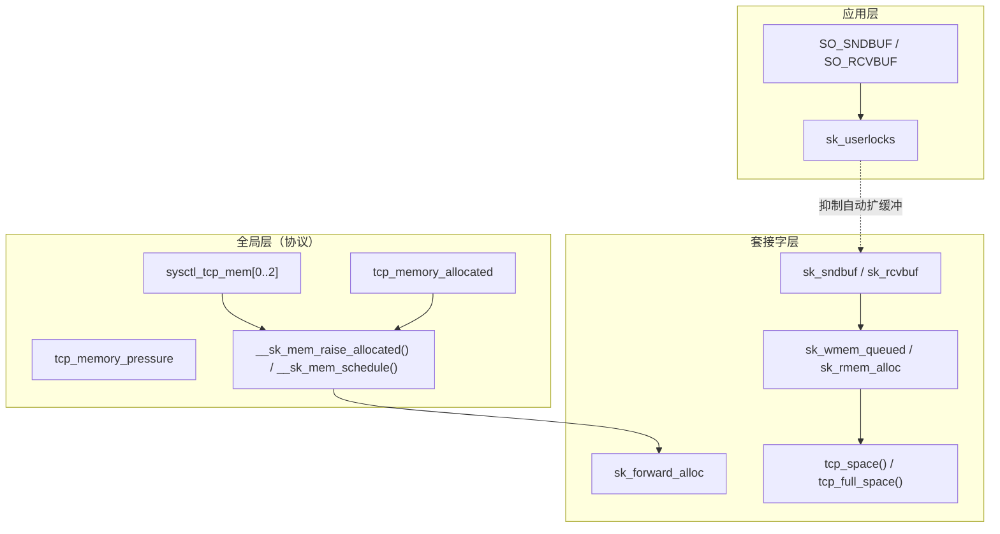

+++
date = '2026-04-29'
title = 'TCP 内存管理与流量控制深度分析'
weight = 17
tags = [
    "TCP",
    "sk_sndbuf",
    "sk_rcvbuf",
    "滑动窗口",
    "零窗口",
    "tcp_memory_pressure",
    "SO_SNDBUF",
    "SO_RCVBUF",
    "流量控制",
]
categories = [
    "网络",
]
+++
# TCP 内存管理与流量控制深度分析

本文基于 **Linux 5.15.78** 内核源码树（本仓库），梳理 TCP 发送/接收缓冲区记账、全局内存压力、滑动窗口与零窗口探测的实现，并说明与 `SO_SNDBUF` / `SO_RCVBUF`、自动调优之间的关系。除专门说明外，路径均相对于内核源码树根目录。

---

## 一、三级内存架构概述

TCP 相关内存与流量控制可以概括为三个层次：

1. **全局（协议级）**：`sysctl_tcp_mem[3]` 与 `tcp_memory_allocated`、压力标志 `tcp_memory_pressure` 配合 `__sk_mem_raise_allocated()`，决定是否在整体上进入压力状态、是否允许新的 `sk_forward_alloc` 预提额度。
2. **套接字（per-socket）**：`sk_sndbuf` / `sk_rcvbuf` 表示发送与接收缓冲上限；`sk_wmem_queued`（流式套接字写队列记账）与 `sk_rmem_alloc`（读方向已分配）参与窗口与阻塞判断。
3. **应用（用户态）**：通过 `setsockopt(SO_SNDBUF/SO_RCVBUF)` 设置缓冲并置位 `SOCK_SNDBUF_LOCK` / `SOCK_RCVBUF_LOCK`，可关闭部分自动扩缩行为。



**要点**：发送路径在分配 `sk_buff` 时调用 `sk_wmem_schedule()` → `__sk_mem_schedule()`，最终受全局三档阈值约束；接收通告窗口由 `tcp_space()`/`tcp_full_space()` 从 `sk_rcvbuf` 扣除开销后得到可用空间，再经 `__tcp_select_window()` 与 SWS 避免策略合成对外通告值。

---

## 二、发送缓冲区管理

### 2.1 发送缓冲区记账

**`sk_wmem_queued` 与 `sk_sndbuf`**

- `sk_sndbuf`：套接字允许的发送缓冲上限（字节量级，与用户 `SO_SNDBUF` 设置及自动调优有关）。
- `sk_wmem_queued`：已排队待发送/重传数据相关的写队列记账。通用流式判断「是否还有发送缓冲余量」时，先比较二者。

`__sk_stream_memory_free()` 在 `sk_wmem_queued >= sk_sndbuf` 时直接判定无空间；否则若协议注册了 `stream_memory_free`，则调用协议钩子（TCP 为 `tcp_stream_memory_free()`）。

```c
// include/net/sock.h:1316-1330
static inline bool __sk_stream_memory_free(const struct sock *sk, int wake)
{
	if (READ_ONCE(sk->sk_wmem_queued) >= READ_ONCE(sk->sk_sndbuf))
		return false;

#ifdef CONFIG_INET
	return sk->sk_prot->stream_memory_free ?
		INDIRECT_CALL_1(sk->sk_prot->stream_memory_free,
			        tcp_stream_memory_free,
				sk, wake) : true;
#else
	return sk->sk_prot->stream_memory_free ?
		sk->sk_prot->stream_memory_free(sk, wake) : true;
#endif
}
```

**`tcp_stream_memory_free()`：`notsent_bytes` 与 `tcp_notsent_lowat`**

TCP 额外约束：**已写入内核但未挂到发送队列的字节数**（`write_seq - snd_nxt`）过大时，即使 `sk_wmem_queued` 未顶满，也可能暂不认为「可写」，从而控制 `EPOLLOUT` 触发频率，与 `sock_def_write_space` 策略类似。

```c
// net/ipv4/tcp_ipv4.c:3821-3832
/* @wake is one when sk_stream_write_space() calls us.
 * This sends EPOLLOUT only if notsent_bytes is half the limit.
 * This mimics the strategy used in sock_def_write_space().
 */
bool tcp_stream_memory_free(const struct sock *sk, int wake)
{
	const struct tcp_sock *tp = tcp_sk(sk);
	u32 notsent_bytes = READ_ONCE(tp->write_seq) -
			    READ_ONCE(tp->snd_nxt);

	return (notsent_bytes << wake) < tcp_notsent_lowat(tp);
}
```

当 `sk_stream_write_space()` 以 `wake == 1` 调用协议钩子时，`notsent_bytes` 左移一位，相当于将阈值放宽一倍，更易满足「可写」条件，便于在唤醒路径上及时通知应用。

### 2.2 发送内存分配

**`sk_stream_alloc_skb()`**

分配发送用 `sk_buff` 时，若处于 TCP 内存压力会尝试 `sk_mem_reclaim_partial()`；正常情况下通过 `sk_wmem_schedule()` 做配额检查，`force_schedule` 为真时走 `sk_forced_mem_schedule()`。

```c
// net/ipv4/tcp.c:1052-1101
struct sk_buff *sk_stream_alloc_skb(struct sock *sk, int size, gfp_t gfp,
				    bool force_schedule)
{
	struct sk_buff *skb;
	// ... 缓存 skb、ALIGN(size,4) 等 ...
	if (unlikely(tcp_under_memory_pressure(sk)))
		sk_mem_reclaim_partial(sk);

	skb = alloc_skb_fclone(size + sk->sk_prot->max_header, gfp);
	if (likely(skb)) {
		bool mem_scheduled;

		if (force_schedule) {
			mem_scheduled = true;
			sk_forced_mem_schedule(sk, skb->truesize);
		} else {
			mem_scheduled = sk_wmem_schedule(sk, skb->truesize);
		}
		if (likely(mem_scheduled)) {
			skb_reserve(skb, sk->sk_prot->max_header);
			skb->reserved_tailroom = skb->end - skb->tail - size;
			INIT_LIST_HEAD(&skb->tcp_tsorted_anchor);
			return skb;
		}
		__kfree_skb(skb);
	} else {
		sk->sk_prot->enter_memory_pressure(sk);
		sk_stream_moderate_sndbuf(sk);
	}
	return NULL;
}
```

**`sk_wmem_schedule()` → `__sk_mem_schedule()`**

`sk_wmem_schedule()` 先计算与 `sk_forward_alloc` 的差额，仅当需要新增配额时才调用 `__sk_mem_schedule()`。`__sk_mem_schedule()` 增加 `sk_forward_alloc` 并调用 `__sk_mem_raise_allocated()`；失败时回滚 `sk_forward_alloc`。

```c
// include/net/sock.h:1525-1532
static inline bool sk_wmem_schedule(struct sock *sk, int size)
{
	int delta;

	if (!sk_has_account(sk))
		return true;
	delta = size - sk->sk_forward_alloc;
	return delta <= 0 || __sk_mem_schedule(sk, delta, SK_MEM_SEND);
}
```

```c
// net/core/sock.c:2867-2876
int __sk_mem_schedule(struct sock *sk, int size, int kind)
{
	int ret, amt = sk_mem_pages(size);

	sk->sk_forward_alloc += amt << SK_MEM_QUANTUM_SHIFT;
	ret = __sk_mem_raise_allocated(sk, size, amt, kind);
	if (!ret)
		sk->sk_forward_alloc -= amt << SK_MEM_QUANTUM_SHIFT;
	return ret;
}
```

### 2.3 发送缓冲区自动调整

**`tcp_should_expand_sndbuf()`**

只有在用户未锁定发送缓冲、未处于（tcp 优化路径上的）内存压力、`sk_memory_allocated` 低于 `sysctl_mem[0]` 软限制、且当前在飞数据未顶满拥塞窗口时，才允许扩展。

```c
// net/ipv4/tcp_input.c:6503-6525
static bool tcp_should_expand_sndbuf(const struct sock *sk)
{
	const struct tcp_sock *tp = tcp_sk(sk);

	if (sk->sk_userlocks & SOCK_SNDBUF_LOCK)
		return false;

	if (tcp_under_memory_pressure(sk))
		return false;

	if (sk_memory_allocated(sk) >= sk_prot_mem_limits(sk, 0))
		return false;

	if (tcp_packets_in_flight(tp) >= tcp_snd_cwnd(tp))
		return false;

	return true;
}
```

**`tcp_sndbuf_expand()`**

按 MSS 估计每段元数据开销 `per_mss`，段数 `nr_segs` 取 `max(初始 cwnd, 当前 cwnd, reordering+1)`，再乘以拥塞算法可选的 `sndbuf_expand` 因子（注释说明 Cubic 一类需要更大系数），并与 `sysctl_tcp_wmem[2]` 取上限。

```c
// net/ipv4/tcp_input.c:671-701
static void tcp_sndbuf_expand(struct sock *sk)
{
	const struct tcp_sock *tp = tcp_sk(sk);
	const struct tcp_congestion_ops *ca_ops = inet_csk(sk)->icsk_ca_ops;
	int sndmem, per_mss;
	u32 nr_segs;

	per_mss = max_t(u32, tp->rx_opt.mss_clamp, tp->mss_cache) +
		  MAX_TCP_HEADER +
		  SKB_DATA_ALIGN(sizeof(struct skb_shared_info));

	per_mss = roundup_pow_of_two(per_mss) +
		  SKB_DATA_ALIGN(sizeof(struct sk_buff));

	nr_segs = max_t(u32, TCP_INIT_CWND, tcp_snd_cwnd(tp));
	nr_segs = max_t(u32, nr_segs, tp->reordering + 1);

	sndmem = ca_ops->sndbuf_expand ? ca_ops->sndbuf_expand(sk) : 2;
	sndmem *= nr_segs * per_mss;

	if (sk->sk_sndbuf < sndmem)
		WRITE_ONCE(sk->sk_sndbuf,
			   min(sndmem, READ_ONCE(sock_net(sk)->ipv4.sysctl_tcp_wmem[2])));
}
```

**`tcp_new_space()` → `tcp_check_space()`**

ACK 推进或发送完成使发送侧腾出新空间后，`tcp_data_snd_check()` 在推帧后调用 `tcp_check_space()`。仅当 `SOCK_NOSPACE` 已置位时才进入 `tcp_new_space()`，避免不必要的扩缓冲与唤醒；`tcp_new_space()` 在满足条件时调用 `tcp_sndbuf_expand()`，并调用 `sk->sk_write_space`（TCP 默认 `sk_stream_write_space`）。

```c
// net/ipv4/tcp_input.c:6528-6566
static void tcp_new_space(struct sock *sk)
{
	struct tcp_sock *tp = tcp_sk(sk);

	if (tcp_should_expand_sndbuf(sk)) {
		tcp_sndbuf_expand(sk);
		tp->snd_cwnd_stamp = tcp_jiffies32;
	}

	INDIRECT_CALL_1(sk->sk_write_space, sk_stream_write_space, sk);
}

void tcp_check_space(struct sock *sk)
{
	smp_mb();
	if (sk->sk_socket &&
	    test_bit(SOCK_NOSPACE, &sk->sk_socket->flags)) {
		tcp_new_space(sk);
		if (!test_bit(SOCK_NOSPACE, &sk->sk_socket->flags))
			tcp_chrono_stop(sk, TCP_CHRONO_SNDBUF_LIMITED);
	}
}

static inline void tcp_data_snd_check(struct sock *sk)
{
	tcp_push_pending_frames(sk);
	tcp_check_space(sk);
}
```

连接进入可使用数据阶段时，`tcp_init_buffer_space()` 在用户未锁 `SO_SNDBUF` 时会主动调用一次 `tcp_sndbuf_expand()`（`net/ipv4/tcp_input.c:811-818`）。

### 2.4 发送阻塞与唤醒

**`sk_stream_wait_memory()`**

发送路径无内存时会等待：设置 `SOCKWQ_ASYNC_NOSPACE`，并在等待循环里对用户态 `socket` 置 `SOCK_NOSPACE`，以便后续 `tcp_check_space()` 能进入 `tcp_new_space()`（见注释与 `do_eagain` 路径）。

```c
// net/core/stream.c:118-181
int sk_stream_wait_memory(struct sock *sk, long *timeo_p)
{
	// ...
	while (1) {
		sk_set_bit(SOCKWQ_ASYNC_NOSPACE, sk);
		// ... 错误/超时/信号处理 ...
		sk_clear_bit(SOCKWQ_ASYNC_NOSPACE, sk);
		if (sk_stream_memory_free(sk) && !vm_wait)
			break;

		set_bit(SOCK_NOSPACE, &sk->sk_socket->flags);
		// ... sk_wait_event ...
	}
	// ...
do_eagain:
	set_bit(SOCK_NOSPACE, &sk->sk_socket->flags);
	err = -EAGAIN;
	goto out;
}
```

**`sk_stream_write_space()`**

当 `__sk_stream_is_writeable(sk, 1)` 为真时清除 `SOCK_NOSPACE` 并唤醒等待写事件的进程/ `fasync`。

```c
// net/core/stream.c:30-46
void sk_stream_write_space(struct sock *sk)
{
	struct socket *sock = sk->sk_socket;
	struct socket_wq *wq;

	if (__sk_stream_is_writeable(sk, 1) && sock) {
		clear_bit(SOCK_NOSPACE, &sock->flags);

		rcu_read_lock();
		wq = rcu_dereference(sk->sk_wq);
		if (skwq_has_sleeper(wq))
			wake_up_interruptible_poll(&wq->wait, EPOLLOUT |
						EPOLLWRNORM | EPOLLWRBAND);
		if (wq && wq->fasync_list && !(sk->sk_shutdown & SEND_SHUTDOWN))
			sock_wake_async(wq, SOCK_WAKE_SPACE, POLL_OUT);
		rcu_read_unlock();
	}
}
```

`__sk_stream_is_writeable()` 定义在 `include/net/sock.h`，同时要求 `sk_stream_wspace`/`sk_stream_min_wspace` 条件与 `__sk_stream_memory_free(sk, wake)` 成立（`include/net/sock.h:1337-1341`）。

---

## 三、接收缓冲区管理

### 3.1 接收缓冲区空间计算

**`tcp_win_from_space()`**

将「缓冲区字节数」转换为「可承载的 TCP 数据量」，扣除 `skb` 元数据等开销：`sysctl_tcp_adv_win_scale` 控制是按移位还是按 `space - (space>>scale)` 扣除。

```c
// include/net/tcp.h:1557-1564
static inline int tcp_win_from_space(const struct sock *sk, int space)
{
	int tcp_adv_win_scale = READ_ONCE(sock_net(sk)->ipv4.sysctl_tcp_adv_win_scale);

	return tcp_adv_win_scale <= 0 ?
		(space>>(-tcp_adv_win_scale)) :
		space - (space>>tcp_adv_win_scale);
}
```

**`tcp_space()` / `tcp_full_space()`**

- `tcp_space()`：当前接收侧「空闲可用于通告」的空间估计：`sk_rcvbuf` 减去 `sk_backlog.len` 与 `sk_rmem_alloc`，再经 `tcp_win_from_space()`。
- `tcp_full_space()`：把总接收缓冲 `sk_rcvbuf` 直接换算为可通告数据上限（用于 `window_clamp`、初始窗口等）。

```c
// include/net/tcp.h:1567-1585
static inline int tcp_space(const struct sock *sk)
{
	return tcp_win_from_space(sk, READ_ONCE(sk->sk_rcvbuf) -
				  READ_ONCE(sk->sk_backlog.len) -
				  atomic_read(&sk->sk_rmem_alloc));
}

static inline int tcp_full_space(const struct sock *sk)
{
	return tcp_win_from_space(sk, READ_ONCE(sk->sk_rcvbuf));
}
```

### 3.2 接收缓冲区自动调整

**`tcp_rcv_space_adjust()`**

在数据从内核复制到用户空间的路径上周期性调用（例如 `tcp_recvmsg()` 成功拷贝后）。若距上次测量已超过约 `RTT/8`，则根据上一 RTT 内拷贝量 `copied` 估算所需窗口；在 `sysctl_tcp_moderate_rcvbuf` 开启且用户未锁 `SO_RCVBUF` 时，增大 `sk_rcvbuf` 并使 `window_clamp` 与之一致（经 `tcp_win_from_space`）。

```c
// net/ipv4/tcp_input.c:1021-1082
void tcp_rcv_space_adjust(struct sock *sk)
{
	struct tcp_sock *tp = tcp_sk(sk);
	u32 copied;
	int time;

	trace_tcp_rcv_space_adjust(sk);

	tcp_mstamp_refresh(tp);
	time = tcp_stamp_us_delta(tp->tcp_mstamp, tp->rcvq_space.time);
	if (time < (tp->rcv_rtt_est.rtt_us >> 3) || tp->rcv_rtt_est.rtt_us == 0)
		return;

	copied = tp->copied_seq - tp->rcvq_space.seq;
	if (copied <= tp->rcvq_space.space)
		goto new_measure;

	if (READ_ONCE(sock_net(sk)->ipv4.sysctl_tcp_moderate_rcvbuf) &&
	    !(sk->sk_userlocks & SOCK_RCVBUF_LOCK)) {
		int rcvmem, rcvbuf;
		u64 rcvwin, grow;
		// ... rcvwin、grow、rcvmem 计算 ...
		rcvbuf = min_t(u64, rcvwin * rcvmem,
			       READ_ONCE(sock_net(sk)->ipv4.sysctl_tcp_rmem[2]));
		if (rcvbuf > sk->sk_rcvbuf) {
			WRITE_ONCE(sk->sk_rcvbuf, rcvbuf);
			tp->window_clamp = tcp_win_from_space(sk, rcvbuf);
		}
	}
	tp->rcvq_space.space = copied;

new_measure:
	tp->rcvq_space.seq = tp->copied_seq;
	tp->rcvq_space.time = tp->tcp_mstamp;
}
```

**`tcp_grow_window()` / `__tcp_grow_window()`**

收到数据后，在有余量且无全局 TCP 压力时，按 `skb` 的 `len/truesize` 关系决定 `rcv_ssthresh` 的增量，用于逐步允许更大通告窗口；并可能置 `icsk_ack.quick` 以触发快速 ACK。

```c
// net/ipv4/tcp_input.c:725-799
static int __tcp_grow_window(const struct sock *sk, const struct sk_buff *skb,
			     unsigned int skbtruesize)
{
	// ... truesize/window 循环比较 ...
}

static void tcp_grow_window(struct sock *sk, const struct sk_buff *skb,
			    bool adjust)
{
	struct tcp_sock *tp = tcp_sk(sk);
	int room;

	room = min_t(int, tp->window_clamp, tcp_space(sk)) - tp->rcv_ssthresh;

	if (room > 0 && !tcp_under_memory_pressure(sk)) {
		unsigned int truesize = truesize_adjust(adjust, skb);
		int incr;
		// ... 计算 incr，更新 tp->rcv_ssthresh ...
	}
}
```

**`tcp_clamp_window()`**

接收内存触顶时的收缩路径：清除 quick ACK；若未锁 `SO_RCVBUF`、无 `tcp_under_memory_pressure`、且全局分配低于 `sysctl_mem[0]`，可尝试把 `sk_rcvbuf` 提升至不超过 `sysctl_tcp_rmem[2]`；若 `sk_rmem_alloc` 仍超过 `sk_rcvbuf`，把 `rcv_ssthresh` 压到约两个 MSS，强制小窗口。

```c
// net/ipv4/tcp_input.c:854-873
static void tcp_clamp_window(struct sock *sk)
{
	struct tcp_sock *tp = tcp_sk(sk);
	struct inet_connection_sock *icsk = inet_csk(sk);
	struct net *net = sock_net(sk);
	int rmem2;

	icsk->icsk_ack.quick = 0;
	rmem2 = READ_ONCE(net->ipv4.sysctl_tcp_rmem[2]);

	if (sk->sk_rcvbuf < rmem2 &&
	    !(sk->sk_userlocks & SOCK_RCVBUF_LOCK) &&
	    !tcp_under_memory_pressure(sk) &&
	    sk_memory_allocated(sk) < sk_prot_mem_limits(sk, 0)) {
		WRITE_ONCE(sk->sk_rcvbuf,
			   min(atomic_read(&sk->sk_rmem_alloc), rmem2));
	}
	if (atomic_read(&sk->sk_rmem_alloc) > sk->sk_rcvbuf)
		tp->rcv_ssthresh = min(tp->window_clamp, 2U * tp->advmss);
}
```

---

## 四、全局 TCP 内存压力

### 4.1 `sysctl_tcp_mem` 初始化

启动时 `tcp_init_mem()` 根据空闲缓冲页数估算三档页数限制（注释中的百分比相对于系统总页数的语境见源码注释），写入 `sysctl_tcp_mem[0..2]`。

```c
// net/ipv4/tcp.c:5070-5077
static void __init tcp_init_mem(void)
{
	unsigned long limit = nr_free_buffer_pages() / 16;

	limit = max(limit, 128UL);
	sysctl_tcp_mem[0] = limit / 4 * 3;		/* 4.68 % */
	sysctl_tcp_mem[1] = limit;			/* 6.25 % */
	sysctl_tcp_mem[2] = sysctl_tcp_mem[0] * 2;	/* 9.37 % */
}
```

`tcp_prot` 将 `sysctl_mem` 指向该数组（`net/ipv4/tcp_ipv4.c:3869`），供 `sk_prot_mem_limits()` 使用。

### 4.2 `tcp_memory_pressure` 标志

文档注释说明该标志被多上下文非原子使用，账是严格的、压力行为是带延迟的「建议」。

```c
// net/ipv4/tcp.c:319-358
unsigned long tcp_memory_pressure __read_mostly;
EXPORT_SYMBOL_GPL(tcp_memory_pressure);

void tcp_enter_memory_pressure(struct sock *sk)
{
	unsigned long val;

	if (READ_ONCE(tcp_memory_pressure))
		return;
	val = jiffies;

	if (!val)
		val--;
	if (!cmpxchg(&tcp_memory_pressure, 0, val))
		NET_INC_STATS(sock_net(sk), LINUX_MIB_TCPMEMORYPRESSURES);
}
EXPORT_SYMBOL_GPL(tcp_enter_memory_pressure);

void tcp_leave_memory_pressure(struct sock *sk)
{
	unsigned long val;

	if (!READ_ONCE(tcp_memory_pressure))
		return;
	val = xchg(&tcp_memory_pressure, 0);
	if (val)
		NET_ADD_STATS(sock_net(sk), LINUX_MIB_TCPMEMORYPRESSURESCHRONO,
			      jiffies_to_msecs(jiffies - val));
}
EXPORT_SYMBOL_GPL(tcp_leave_memory_pressure);
```

### 4.3 `__sk_mem_raise_allocated()` 三档阈值

`atomic_long_add_return` 得到新的 `allocated` 后与 `sk_prot_mem_limits(sk, 0/1/2)` 比较：低于低档调用 `sk_leave_memory_pressure`；高于中档 `sk_enter_memory_pressure`；高于高档则可能 `suppress_allocation`，并在流式发送侧可能调用 `sk_stream_moderate_sndbuf` 后仍尝试保证不低于 `sndbuf` 的特殊路径（见 `kind == SK_MEM_SEND` 分支）。

```c
// net/core/sock.c:2772-2854
int __sk_mem_raise_allocated(struct sock *sk, int size, int amt, int kind)
{
	struct proto *prot = sk->sk_prot;
	long allocated = sk_memory_allocated_add(sk, amt);
	bool memcg_charge = mem_cgroup_sockets_enabled && sk->sk_memcg;
	bool charged = true;
	// ... memcg ...
	if (allocated <= sk_prot_mem_limits(sk, 0)) {
		sk_leave_memory_pressure(sk);
		return 1;
	}

	if (allocated > sk_prot_mem_limits(sk, 1))
		sk_enter_memory_pressure(sk);

	if (allocated > sk_prot_mem_limits(sk, 2))
		goto suppress_allocation;

	/* guarantee minimum buffer size under pressure */
	if (kind == SK_MEM_RECV) {
		if (atomic_read(&sk->sk_rmem_alloc) < sk_get_rmem0(sk, prot))
			return 1;

	} else { /* SK_MEM_SEND */
		int wmem0 = sk_get_wmem0(sk, prot);

		if (sk->sk_type == SOCK_STREAM) {
			if (sk->sk_wmem_queued < wmem0)
				return 1;
		} else if (refcount_read(&sk->sk_wmem_alloc) < wmem0) {
				return 1;
		}
	}

	if (sk_has_memory_pressure(sk)) {
		// ... sockets_allocated 与 limit[2] 比例判断 ...
	}

suppress_allocation:
	if (kind == SK_MEM_SEND && sk->sk_type == SOCK_STREAM) {
		sk_stream_moderate_sndbuf(sk);
		if (sk->sk_wmem_queued + size >= sk->sk_sndbuf) {
			// ... 强制 charge ...
			return 1;
		}
	}
	// ... trace、回滚 atomic、uncharge ...
	return 0;
}
```

### 4.4 `tcp_under_memory_pressure()` 与路径影响

TCP 套接字优先读全局 `tcp_memory_pressure`，并叠加大 memcg 的 socket 压力。

```c
// include/net/tcp.h:259-267
static inline bool tcp_under_memory_pressure(const struct sock *sk)
{
	if (mem_cgroup_sockets_enabled && sk->sk_memcg &&
	    mem_cgroup_under_socket_pressure(sk->sk_memcg))
		return true;

	return READ_ONCE(tcp_memory_pressure);
}
```

**影响归纳（源码中可直接追踪的分支）**：

- **发送分配**：`sk_stream_alloc_skb()` 在压力下 reclaim（`net/ipv4/tcp.c:1074-1075`）；alloc 失败时 `enter_memory_pressure` + `sk_stream_moderate_sndbuf`（`1097-1099`）。
- **扩发送缓冲**：`tcp_should_expand_sndbuf()` 直接禁止（`net/ipv4/tcp_input.c:6513-6515`）。
- **接收窗增长**：`tcp_grow_window()` 要求 `!tcp_under_memory_pressure`（`784`）；`tcp_clamp_window()` 在压力下去掉扩 `sk_rcvbuf` 分支条件（`866`）。
- **通告窗计算**：`__tcp_select_window()` 在 `free_space` 低于半满时可能依据压力压缩 `rcv_ssthresh`（`net/ipv4/tcp_output.c:3852-3854`）。
- **延迟 ACK 与回收**：`tcp_delack_timer_handler()` 在收尾处若 `tcp_under_memory_pressure(sk)` 则调用 `sk_mem_reclaim(sk)`（`net/ipv4/tcp_timer.c:322-324`）。注意 **`tcp_probe_timer()` 本身不在开头检查** `tcp_under_memory_pressure`，零窗探测路径见第六节。

---

## 五、滑动窗口与通告窗口

### 5.1 初始窗口

`tcp_select_initial_window()` 根据可用空间、MSS、`window_clamp`、是否 workaround 有符号窗口、以及是否协商 Window Scale 等综合计算初始 `rcv_wnd`、缩放因子与更新后的 `window_clamp`。

```c
// net/ipv4/tcp_output.c:280-324
void tcp_select_initial_window(const struct sock *sk, int __space, __u32 mss,
			       __u32 *rcv_wnd, __u32 *window_clamp,
			       int wscale_ok, __u8 *rcv_wscale,
			       __u32 init_rcv_wnd)
{
	unsigned int space = (__space < 0 ? 0 : __space);
	// ... window_clamp 初始化、按 MSS 对齐 ...
	if (sock_net(sk)->ipv4.sysctl_tcp_workaround_signed_windows)
		(*rcv_wnd) = min(space, MAX_TCP_WINDOW);
	else
		(*rcv_wnd) = min_t(u32, space, U16_MAX);
	// ... init_rcv_wnd、rcv_wscale、window_clamp 上限 ...
}
```

### 5.2 窗口选择与「不收缩」语义

**当前接收窗口（对端视角的可用量）**

```c
// include/net/tcp.h:738-745
static inline u32 tcp_receive_window(const struct tcp_sock *tp)
{
	s32 win = tp->rcv_wup + tp->rcv_wnd - tp->rcv_nxt;

	if (win < 0)
		win = 0;
	return (u32) win;
}
```

**`tcp_select_window()`**

用 `__tcp_select_window()` 得到缩放前的 `new_win`，若小于当前实际可用 `cur_win` 则禁止收缩；`new_win==0` 时计 `TCPWANTZEROWINDOWADV`。最后应用缩放、处理零窗统计 `TCPTOZEROWINDOWADV`，以及从0窗口恢复的 `TCPFROMZEROWINDOWADV`。

```c
// net/ipv4/tcp_output.c:374-418
static u16 tcp_select_window(struct sock *sk)
{
	struct tcp_sock *tp = tcp_sk(sk);
	u32 old_win = tp->rcv_wnd;
	u32 cur_win = tcp_receive_window(tp);
	u32 new_win = __tcp_select_window(sk);

	if (new_win < cur_win) {
		if (new_win == 0)
			NET_INC_STATS(sock_net(sk),
				      LINUX_MIB_TCPWANTZEROWINDOWADV);
		new_win = ALIGN(cur_win, 1 << tp->rx_opt.rcv_wscale);
	}

	tp->rcv_wnd = new_win;
	tp->rcv_wup = tp->rcv_nxt;
	// ... 缩放、最大窗口夹紧 ...
	if (new_win == 0) {
		tp->pred_flags = 0;
		if (old_win)
			NET_INC_STATS(sock_net(sk),
				      LINUX_MIB_TCPTOZEROWINDOWADV);
	} else if (old_win == 0) {
		NET_INC_STATS(sock_net(sk), LINUX_MIB_TCPFROMZEROWINDOWADV);
	}

	return new_win;
}
```

**`__tcp_select_window()`**（SWS、压力、缩放对齐核心）

```c
// net/ipv4/tcp_output.c:3824-3903
u32 __tcp_select_window(struct sock *sk)
{
	struct inet_connection_sock *icsk = inet_csk(sk);
	struct tcp_sock *tp = tcp_sk(sk);
	int mss = icsk->icsk_ack.rcv_mss;
	int free_space = tcp_space(sk);
	int allowed_space = tcp_full_space(sk);
	int full_space, window;

	if (sk_is_mptcp(sk))
		mptcp_space(sk, &free_space, &allowed_space);

	full_space = min_t(int, tp->window_clamp, allowed_space);
	// ... mss 与 free_space 关系 ...
	if (free_space < (full_space >> 1)) {
		icsk->icsk_ack.quick = 0;

		if (tcp_under_memory_pressure(sk))
			tp->rcv_ssthresh = min(tp->rcv_ssthresh,
					       4U * tp->advmss);
		// ... round_down free_space ...
		if (free_space < (allowed_space >> 4) || free_space < mss)
			return 0;
	}

	if (free_space > tp->rcv_ssthresh)
		free_space = tp->rcv_ssthresh;

	if (tp->rx_opt.rcv_wscale) {
		window = free_space;
		window = ALIGN(window, (1 << tp->rx_opt.rcv_wscale));
	} else {
		// ... 无缩放时按 MSS 取整 ...
	}

	return window;
}
```

---

## 六、零窗口探测

### 6.1 探测定时器

`tcp_probe_timer()` 在「有未发数据在队列首且没有在飞包」场景下递增 `icsk_probes_out`，受 `sysctl_tcp_retries2`、orphan、`TCP_USER_TIMEOUT` 等约束；未超限则调用 `tcp_send_probe0()`。

```c
// net/ipv4/tcp_timer.c:356-400
static void tcp_probe_timer(struct sock *sk)
{
	struct inet_connection_sock *icsk = inet_csk(sk);
	struct sk_buff *skb = tcp_send_head(sk);
	struct tcp_sock *tp = tcp_sk(sk);
	int max_probes;

	if (tp->packets_out || !skb) {
		icsk->icsk_probes_out = 0;
		icsk->icsk_probes_tstamp = 0;
		return;
	}
	// ... user timeout / orphan / out_of_resources ...
	max_probes = READ_ONCE(sock_net(sk)->ipv4.sysctl_tcp_retries2);
	// ...
	if (icsk->icsk_probes_out >= max_probes) {
abort:		tcp_write_err(sk);
	} else {
		tcp_send_probe0(sk);
	}
}
```

### 6.2 `tcp_send_probe0()` → `tcp_write_wakeup()` → `tcp_xmit_probe_skb()`

`tcp_send_probe0()` 调用 `tcp_write_wakeup()`；若无合适可发数据段则在 `tcp_write_wakeup()` 末尾通过 `tcp_xmit_probe_skb()` 发序列号为 `snd_una` 或其变体的纯 ACK 探测包，并统计 `LINUX_MIB_TCPWINPROBE`。

```c
// net/ipv4/tcp_output.c:5087-5107
static int tcp_xmit_probe_skb(struct sock *sk, int urgent, int mib)
{
	struct tcp_sock *tp = tcp_sk(sk);
	struct sk_buff *skb;

	skb = alloc_skb(MAX_TCP_HEADER,
			sk_gfp_mask(sk, GFP_ATOMIC | __GFP_NOWARN));
	if (!skb)
		return -1;

	skb_reserve(skb, MAX_TCP_HEADER);
	tcp_init_nondata_skb(skb, tp->snd_una - !urgent, TCPHDR_ACK);
	NET_INC_STATS(sock_net(sk), mib);
	return tcp_transmit_skb(sk, skb, 0, (__force gfp_t)0);
}
```

```c
// net/ipv4/tcp_output.c:5182-5213
void tcp_send_probe0(struct sock *sk)
{
	struct inet_connection_sock *icsk = inet_csk(sk);
	struct tcp_sock *tp = tcp_sk(sk);
	struct net *net = sock_net(sk);
	unsigned long timeout;
	int err;

	err = tcp_write_wakeup(sk, LINUX_MIB_TCPWINPROBE);

	if (tp->packets_out || tcp_write_queue_empty(sk)) {
		icsk->icsk_probes_out = 0;
		icsk->icsk_backoff = 0;
		icsk->icsk_probes_tstamp = 0;
		return;
	}

	icsk->icsk_probes_out++;
	if (err <= 0) {
		if (icsk->icsk_backoff < READ_ONCE(net->ipv4.sysctl_tcp_retries2))
			icsk->icsk_backoff++;
		timeout = tcp_probe0_when(sk, TCP_RTO_MAX);
	} else {
		timeout = TCP_RESOURCE_PROBE_INTERVAL;
	}

	timeout = tcp_clamp_probe0_to_user_timeout(sk, timeout);
	tcp_reset_xmit_timer(sk, ICSK_TIME_PROBE0, timeout, TCP_RTO_MAX);
}
```

### 6.3 接收端退出零窗口

当此前通告窗口为 0、本次计算出的缩放后 `new_win` 非 0 时，`tcp_select_window()` 统计 `LINUX_MIB_TCPFROMZEROWINDOWADV`（`net/ipv4/tcp_output.c:413-415`），表示**对端（本实现视角下曾为发送方）将观察到窗口从 0 打开**。与 `__tcp_select_window()` 返回 0 导致的零窗口通告共同构成流量控制的两侧行为。

**退避与最大探测次数**：`icsk_backoff` 与 `sysctl_tcp_retries2` 限制最大探测轮次；超时与用户定时器路径可能导致 `tcp_write_err()` 关闭连接（`tcp_probe_timer()`）。

---

## 七、`SO_SNDBUF` / `SO_RCVBUF` 与自动调优

### 7.1 `setsockopt` 路径与 `sk_userlocks`

`SO_RCVBUF` 经 `__sock_set_rcvbuf()`：对用户值乘 2 计入元数据开销，并置 `SOCK_RCVBUF_LOCK`。

```c
// net/core/sock.c:925-944
static void __sock_set_rcvbuf(struct sock *sk, int val)
{
	val = min_t(int, val, INT_MAX / 2);
	sk->sk_userlocks |= SOCK_RCVBUF_LOCK;
	WRITE_ONCE(sk->sk_rcvbuf, max_t(int, val * 2, SOCK_MIN_RCVBUF));
}
```

`SO_SNDBUF` 在夹紧 `sysctl_wmem_max` 后同样乘 2，置 `SOCK_SNDBUF_LOCK`，并调用 `sk_write_space` 唤醒可能等待的写者。

```c
// net/core/sock.c:1029-1046
case SO_SNDBUF:
	val = min_t(u32, val, READ_ONCE(sysctl_wmem_max));
set_sndbuf:
	val = min_t(int, val, INT_MAX / 2);
	sk->sk_userlocks |= SOCK_SNDBUF_LOCK;
	WRITE_ONCE(sk->sk_sndbuf,
		   max_t(int, val * 2, SOCK_MIN_SNDBUF));
	sk->sk_write_space(sk);
	break;
```

锁定位定义于 UAPI（例如 `include/uapi/linux/socket.h` 中 `SOCK_SNDBUF_LOCK`、`SOCK_RCVBUF_LOCK`）。

### 7.2 自动调优与 `sk_userlocks` 对照

| 函数 | 文件:行号（约） | 是否受 `SOCK_SNDBUF_LOCK` 影响 | 是否受 `SOCK_RCVBUF_LOCK` 影响 |
|------|-----------------|--------------------------------|--------------------------------|
| `tcp_should_expand_sndbuf()` | `net/ipv4/tcp_input.c:6510-6511` | 是（锁定则返回 false） | 否 |
| `tcp_sndbuf_expand()` | `net/ipv4/tcp_input.c:671-701` | 仅在被调用时生效；调用前由 `tcp_should_expand_sndbuf` 或 `tcp_init_buffer_space` 约束 | 否 |
| `tcp_init_buffer_space()` 初调 `tcp_sndbuf_expand` | `net/ipv4/tcp_input.c:817-818` | 是（无 `SOCK_SNDBUF_LOCK` 才调用） | 否 |
| `tcp_rcv_space_adjust()` 自动增大 `sk_rcvbuf` | `net/ipv4/tcp_input.c:1048-1049` | 否 | 是（锁定则跳过） |
| `tcp_clamp_window()` 中增大 `sk_rcvbuf` | `net/ipv4/tcp_input.c:864-869` | 否 | 是（锁定则不进入扩缓冲分支） |

**小结**：用户固定 `SO_SNDBUF` 会关闭发送方向基于拥塞与 RTT 估计的自动扩容闸门；固定 `SO_RCVBUF` 会关闭接收方向基于拷贝速率的缓冲自调节及压力下的部分扩容策略，从而窗口行为更依赖应用设定与 `window_clamp` 初始化。

---

## 参考索引（本文引用的主要符号）

| 主题 | 位置 |
|------|------|
| 流式内存空闲判断 | `include/net/sock.h` `__sk_stream_memory_free` |
| TCP 写侧 notsent 限制 | `net/ipv4/tcp_ipv4.c` `tcp_stream_memory_free` |
| skb 分配与 wmem 记账 | `net/ipv4/tcp.c` `sk_stream_alloc_skb` |
| 内存调度 | `include/net/sock.h` `sk_wmem_schedule`，`net/core/sock.c` `__sk_mem_schedule`，`__sk_mem_raise_allocated` |
| 扩 sndbuf / 判定 | `net/ipv4/tcp_input.c` `tcp_sndbuf_expand`，`tcp_should_expand_sndbuf`，`tcp_check_space` |
| 发送阻塞 | `net/core/stream.c` `sk_stream_wait_memory`，`sk_stream_write_space` |
| 接收空间换算 | `include/net/tcp.h` `tcp_win_from_space`，`tcp_space`，`tcp_full_space` |
| 接收自动调优 | `net/ipv4/tcp_input.c` `tcp_rcv_space_adjust`，`tcp_grow_window`，`tcp_clamp_window` |
| 全局 mem 与压力 | `net/ipv4/tcp.c` `sysctl_tcp_mem` 初始化，`tcp_memory_pressure`，`tcp_under_memory_pressure` |
| 窗口与零窗 | `net/ipv4/tcp_output.c` `tcp_select_initial_window`，`tcp_select_window`，`__tcp_select_window`；`include/net/tcp.h` `tcp_receive_window` |
| 零窗探测 | `net/ipv4/tcp_timer.c` `tcp_probe_timer`；`net/ipv4/tcp_output.c` `tcp_send_probe0`，`tcp_write_wakeup`，`tcp_xmit_probe_skb` |
| 延迟 ACK 与压力回收 | `net/ipv4/tcp_timer.c` `tcp_delack_timer_handler`（末尾 `sk_mem_reclaim`） |
| setsockopt | `net/core/sock.c` `__sock_set_rcvbuf`，`SO_SNDBUF`/`SO_RCVBUF` 分支 |

以上内容均可直接在上述路径与行号处与 Linux 5.15.78 本仓库树核对。
