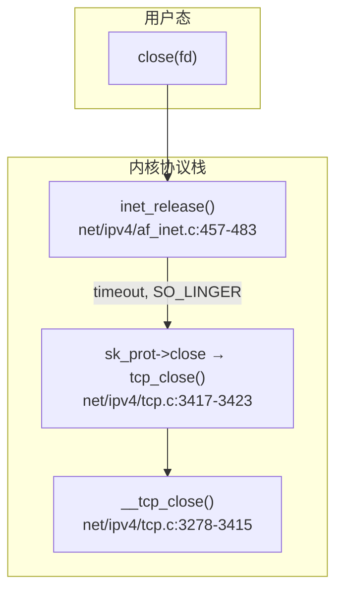

+++
date = '2026-04-29'
title = 'TCP 四次挥手与 close 深度源码分析'
weight = 18
tags = [
    "TCP",
    "close",
    "shutdown",
    "FIN",
    "TIME_WAIT",
    "tcp_close",
    "tcp_send_fin",
    "tcp_fin",
    "tcp_time_wait",
    "SO_LINGER",
    "orphan",
    "inet_twsk_hashdance",
]
categories = [
    "网络",
]
+++
本文基于 **Linux 5.15.78** 内核源码，梳理 `close()`/`shutdown()` 触发的发送 FIN、对端 FIN 处理、进入 `TIME_WAIT`、孤儿套接字与 `tcp_tw_reuse` 复用等与四次挥手相关的实现。文中凡引用符号、路径、行号均以仓库内源码为准。

---

## 一、全景调用链与状态转换表

### 1.1 应用层 close 到 TCP 栈

用户进程执行 `close(fd)` 时，VFS 最终调用到 INET 的 `inet_release()`，由其根据 `SO_LINGER` 计算超时并调用协议 `close`。对 TCP 而言即 `tcp_close()` → `__tcp_close()`。



对应源码中 `inet_release()` 对 `SO_LINGER` 与 `tcp_close` 的衔接如下。

```c
// net/ipv4/af_inet.c:471-479
		timeout = 0;
		if (sock_flag(sk, SOCK_LINGER) &&
		    !(current->flags & PF_EXITING))
			timeout = sk->sk_lingertime;

		/* 调用协议特定close: tcp_close() */
		sk->sk_prot->close(sk, timeout);
```

`struct proto tcp_proto` 将 `close` 成员指向 `tcp_close`（`net/ipv4/tcp_ipv4.c:3838`）。

`tcp_close()` 仅加锁并委托 `__tcp_close()`：

```c
// net/ipv4/tcp.c:3417-3423
void tcp_close(struct sock *sk, long timeout)
{
	lock_sock(sk);
	__tcp_close(sk, timeout);
	release_sock(sk);
	sock_put(sk);
}
```

### 1.2 `tcp_close_state()` 与 `new_state[]`

`tcp_close_state()` 根据当前 `sk->sk_state` 查表 `new_state[]`，低 4 位为 RFC 状态（`TCP_STATE_MASK`），若高位含 `TCP_ACTION_FIN` 则表示本路径需要发送 FIN。`TCP_ACTION_FIN` 定义为 `(1 << TCP_CLOSE)`，即与枚举值 `TCP_CLOSE`（值为 9）组合编码进数组元素中。

宏与状态掩码定义见 `include/net/tcp_states.h:12-31`。

`new_state[]` 与 `tcp_close_state()`：

```c
// net/ipv4/tcp.c:3169-3194
static const unsigned char new_state[16] = {
  /* current state:        new state:      action:	*/
  [0 /* (Invalid) */]	= TCP_CLOSE,
  [TCP_ESTABLISHED]	= TCP_FIN_WAIT1 | TCP_ACTION_FIN,
  [TCP_SYN_SENT]	= TCP_CLOSE,
  [TCP_SYN_RECV]	= TCP_FIN_WAIT1 | TCP_ACTION_FIN,
  [TCP_FIN_WAIT1]	= TCP_FIN_WAIT1,
  [TCP_FIN_WAIT2]	= TCP_FIN_WAIT2,
  [TCP_TIME_WAIT]	= TCP_CLOSE,
  [TCP_CLOSE]		= TCP_CLOSE,
  [TCP_CLOSE_WAIT]	= TCP_LAST_ACK  | TCP_ACTION_FIN,
  [TCP_LAST_ACK]	= TCP_LAST_ACK,
  [TCP_LISTEN]		= TCP_CLOSE,
  [TCP_CLOSING]		= TCP_CLOSING,
  [TCP_NEW_SYN_RECV]	= TCP_CLOSE,	/* should not happen ! */
};

static int tcp_close_state(struct sock *sk)
{
	int next = (int)new_state[sk->sk_state];
	int ns = next & TCP_STATE_MASK;

	tcp_set_state(sk, ns);

	return next & TCP_ACTION_FIN;
}
```

下表归纳「当前状态 → 关闭发送侧后的新状态 → 是否置 `TCP_ACTION_FIN`（需要 `tcp_send_fin`）」。

| 当前状态 (`sk_state`) | `new_state[]` 中新状态 (掩码后) | 含 `TCP_ACTION_FIN` | 说明 |
|----------------------|----------------------------------|---------------------|------|
| 无效 (0) | `TCP_CLOSE` | 否 | 异常占位 |
| `TCP_ESTABLISHED` | `TCP_FIN_WAIT1` | **是** | 主动发 FIN |
| `TCP_SYN_SENT` | `TCP_CLOSE` | 否 | 未建立则不组合 FIN 等待 |
| `TCP_SYN_RECV` | `TCP_FIN_WAIT1` | **是** | 并发打开等场景 |
| `TCP_FIN_WAIT1` | `TCP_FIN_WAIT1` | 否 | 已发/将发 FIN，由状态机继续 |
| `TCP_FIN_WAIT2` | `TCP_FIN_WAIT2` | 否 | 仅接收侧相关 |
| `TCP_TIME_WAIT` | `TCP_CLOSE` | 否 | 不应再发 FIN |
| `TCP_CLOSE` | `TCP_CLOSE` | 否 | 已关闭 |
| `TCP_CLOSE_WAIT` | `TCP_LAST_ACK` | **是** | 被动方应用 close，补发 FIN |
| `TCP_LAST_ACK` | `TCP_LAST_ACK` | 否 | 已发 FIN，等 ACK |
| `TCP_LISTEN` | `TCP_CLOSE` | 否 | 由 `__tcp_close` 另分支处理 |
| `TCP_CLOSING` | `TCP_CLOSING` | 否 | 同时关闭进行中 |
| `TCP_NEW_SYN_RECV` | `TCP_CLOSE` | 否 | 注释声明不应发生 |

### 1.3 与四次挥手条款的对应（概念层）

- 主动关闭方在能够优雅关闭且接收队列已排空时，经 `tcp_close_state` + `tcp_send_fin` 进入 `FIN_WAIT1`，随后在 ACK/FIN 交互下经 `FIN_WAIT2`、`TIME_WAIT` 到释放。
- 被动方收到 FIN 后先 `CLOSE_WAIT`，应用 `close` 后再发 FIN 进入 `LAST_ACK`。
- 上述「概念」均由下文「二」至「五」节对应源码路径支撑；具体是否发 RST、是否进入 `TIME_WAIT` 取决于未读数据、`SO_LINGER`、`linger2`、孤儿限制等分支。

---

## 二、`tcp_close()` 完整路径

### 2.1 总览：`__tcp_close()` 入口行为

`__tcp_close()`（`net/ipv4/tcp.c:3278-3415`）是关闭逻辑核心：设置全双工 shutdown、LISTEN 特判、清空接收队列并统计未读长度、在多种条件下选择 RST / `disconnect` / 正常 FIN，然后 `sk_stream_wait_close`、`sock_orphan`、递增每 CPU 孤儿计数、处理 `FIN_WAIT2` 定时与 OOM、最终在 `TCP_CLOSE` 时 `inet_csk_destroy_sock`。

关键开头与 LISTEN 分支：

```c
// net/ipv4/tcp.c:3278-3293
void __tcp_close(struct sock *sk, long timeout)
{
	struct sk_buff *skb;
	int data_was_unread = 0;
	int state;

	/* 设置关闭标志: 不再发送和接收 */
	sk->sk_shutdown = SHUTDOWN_MASK;

	/* 情况1: 监听socket直接关闭 */
	if (sk->sk_state == TCP_LISTEN) {
		tcp_set_state(sk, TCP_CLOSE);
		/* 关闭accept队列, 向已连接client发RST */
		inet_csk_listen_stop(sk);
		goto adjudge_to_death;
	}
```

其中 `SHUTDOWN_MASK` 表示同时关闭读与写方向，定义于 `include/net/sock.h:1463-1465`（`RCV_SHUTDOWN` 与 `SEND_SHUTDOWN` 的按位组合为 3）。

### 2.2 接收队列排空与 RST / FIN 决策

`__tcp_close` 将 `sk_receive_queue` 上 skb 全部 dequeue，并对每段计算「非 FIN 负载长度」累加到 `data_was_unread`。若队列末尾 skb 带 `TCPHDR_FIN`，长度减一（FIN 占序列空间但不计入「未读数据」长度统计）。

随后逻辑（节选）：

```c
// net/ipv4/tcp.c:3295-3330
	/* 清空接收队列, 统计未读数据量 */
	while ((skb = __skb_dequeue(&sk->sk_receive_queue)) != NULL) {
		u32 len = TCP_SKB_CB(skb)->end_seq - TCP_SKB_CB(skb)->seq;
		if (TCP_SKB_CB(skb)->tcp_flags & TCPHDR_FIN)
			len--;
		data_was_unread += len;
		__kfree_skb(skb);
	}
    // ...
	if (sk->sk_state == TCP_CLOSE)
		goto adjudge_to_death;

	if (unlikely(tcp_sk(sk)->repair)) {
		sk->sk_prot->disconnect(sk, 0);
	} else if (data_was_unread) {
		NET_INC_STATS(sock_net(sk), LINUX_MIB_TCPABORTONCLOSE);
		tcp_set_state(sk, TCP_CLOSE);
		tcp_send_active_reset(sk, sk->sk_allocation);
	} else if (sock_flag(sk, SOCK_LINGER) && !sk->sk_lingertime) {
		sk->sk_prot->disconnect(sk, 0);
		NET_INC_STATS(sock_net(sk), LINUX_MIB_TCPABORTONDATA);
	} else if (tcp_close_state(sk)) {
		tcp_send_fin(sk);
	}

	sk_stream_wait_close(sk, timeout);
```

含义归纳：

1. **`data_was_unread != 0`**：接收侧仍有应用未读数据时直接 `TCP_CLOSE` 并 `tcp_send_active_reset`（RST），统计 `TCPABORTONCLOSE`。
2. **`SO_LINGER` 且 `sk_lingertime == 0`**：调用 `disconnect` 走中止路径，统计 `TCPABORTONDATA`（与「正常 FIN 四次挥手」区分）。
3. **否则**若 `tcp_close_state()` 返回真则 `tcp_send_fin()` 发 FIN。

### 2.3 `SO_LINGER` 与 `sk_stream_wait_close()`

非零 `timeout`（来自 `inet_release` 传入的 `sk_lingertime`， jiffies）时，`sk_stream_wait_close()` 会把当前进程放到 `sk_sleep` 上等待，直到「不再处于需等待发送 FIN 确认的阶段」或超时、信号。

```c
// net/core/stream.c:90-110
static inline int sk_stream_closing(struct sock *sk)
{
	return (1 << sk->sk_state) &
	       (TCPF_FIN_WAIT1 | TCPF_CLOSING | TCPF_LAST_ACK);
}

void sk_stream_wait_close(struct sock *sk, long timeout)
{
	if (timeout) {
		DEFINE_WAIT_FUNC(wait, woken_wake_function);

		add_wait_queue(sk_sleep(sk), &wait);

		do {
			if (sk_wait_event(sk, &timeout, !sk_stream_closing(sk), &wait))
				break;
		} while (!signal_pending(current) && timeout);

		remove_wait_queue(sk_sleep(sk), &wait);
	}
}
```

等待条件 `!sk_stream_closing(sk)`：一旦状态离开 `FIN_WAIT1`/`CLOSING`/`LAST_ACK`（例如进入 `FIN_WAIT2`、`TIME_WAIT` 或由 RST 直接 `CLOSE`），等待结束。

### 2.4 `sock_orphan()` 与 `tcp_orphan_count`

`adjudge_to_death` 标签后，`__tcp_close` 调用 `sock_orphan(sk)`，将套接字与 `struct socket` 解绑并置 `SOCK_DEAD`，随后在本 CPU 上 `tcp_orphan_count` 自增。

```c
// net/ipv4/tcp.c:3335-3346
adjudge_to_death:
	state = sk->sk_state;
	sock_hold(sk);
	sock_orphan(sk);

	local_bh_disable();
	bh_lock_sock(sk);
	__release_sock(sk);

	this_cpu_inc(tcp_orphan_count);
```

`sock_orphan` 本体（设置死标志、断开 `sk_socket`/`sk_wq`）：

```c
// include/net/sock.h:1960-1967
static inline void sock_orphan(struct sock *sk)
{
	write_lock_bh(&sk->sk_callback_lock);
	sock_set_flag(sk, SOCK_DEAD);
	sk_set_socket(sk, NULL);
	sk->sk_wq  = NULL;
	write_unlock_bh(&sk->sk_callback_lock);
}
```

每 CPU 计数器定义：

```c
// net/ipv4/tcp.c:290-291
DEFINE_PER_CPU(unsigned int, tcp_orphan_count);
EXPORT_PER_CPU_SYMBOL_GPL(tcp_orphan_count);
```

### 2.5 `tcp_close_state()` 再述：哪些状态会触发 FIN

已在第一章说明：`TCP_ESTABLISHED`、`TCP_SYN_RECV`、`TCP_CLOSE_WAIT` 在「无 RST/abort 前置条件」下会置 `TCP_ACTION_FIN`，从而执行 `tcp_send_fin()`。`FIN_WAIT1/2`、`CLOSING`、`LAST_ACK` 等不会在 `tcp_close_state` 里再次请求 FIN。

### 2.6 `FIN_WAIT2` 与 `linger2`、`tcp_time_wait`

`__tcp_close` 在 orphan 之后若状态为 `TCP_FIN_WAIT2`，根据 `linger2`、`tcp_fin_time(sk)`、`TCP_TIMEWAIT_LEN` 决定 reset、`keepalive` 定时器或立即 `tcp_time_wait(sk, TCP_FIN_WAIT2, tmo)`（见 `net/ipv4/tcp.c:3365-3381`）。第七节展开孤儿与 OOM 检查。

---

## 三、FIN 发送

### 3.1 `tcp_shutdown()`：半关闭只影响发送侧

`shutdown(SHUT_WR)` 最终走到 `tcp_shutdown()`。仅当 `how` 含 `SEND_SHUTDOWN` 且状态属于可发 FIN 的集合时，才 `tcp_close_state` + `tcp_send_fin`。

```c
// net/ipv4/tcp.c:3201-3218
void tcp_shutdown(struct sock *sk, int how)
{
	if (!(how & SEND_SHUTDOWN))
		return;

	if ((1 << sk->sk_state) &
	    (TCPF_ESTABLISHED | TCPF_SYN_SENT |
	     TCPF_SYN_RECV | TCPF_CLOSE_WAIT)) {
		if (tcp_close_state(sk))
			tcp_send_fin(sk);
	}
}
```

与 `__tcp_close` 的差异之一：`tcp_shutdown` **不会**设置 `SHUTDOWN_MASK`、不会 drain 接收队列、不会 `sock_orphan`（文件 `tcp.c:3196-3198` 注释已说明）。

### 3.2 `tcp_send_fin()`：尾包 piggyback、内存压力下 borrow rtx、mss 推送

```c
// net/ipv4/tcp_output.c:4341-4383
void tcp_send_fin(struct sock *sk)
{
	struct sk_buff *skb, *tskb, *tail = tcp_write_queue_tail(sk);
	struct tcp_sock *tp = tcp_sk(sk);

	tskb = tail;
	if (!tskb && tcp_under_memory_pressure(sk))
		tskb = skb_rb_last(&sk->tcp_rtx_queue);

	if (tskb) {
		TCP_SKB_CB(tskb)->tcp_flags |= TCPHDR_FIN;
		TCP_SKB_CB(tskb)->end_seq++;
		tp->write_seq++;
		if (!tail) {
			WRITE_ONCE(tp->snd_nxt, tp->snd_nxt + 1);
			return;
		}
	} else {
		skb = alloc_skb_fclone(MAX_TCP_HEADER, sk->sk_allocation);
		if (unlikely(!skb))
			return;
        // ...
		tcp_init_nondata_skb(skb, tp->write_seq,
				     TCPHDR_ACK | TCPHDR_FIN);
		tcp_queue_skb(sk, skb);
	}
	__tcp_push_pending_frames(sk, tcp_current_mss(sk), TCP_NAGLE_OFF);
}
```

要点：

- **优先**在写队列尾部未发 skb 上打 FIN 位并推进 `write_seq`。
- **无尾包且处于 memory pressure** 时，尝试在 **重传队列** 最后一 skb 上挂 FIN（注释说明：栈会认为该 FIN「已发送」，需通过超时路径送出）。
- **否则**分配精简 skb，`tcp_init_nondata_skb(..., TCPHDR_ACK | TCPHDR_FIN)` 入队并 `__tcp_push_pending_frames`。

---

## 四、FIN 接收

### 4.1 `tcp_fin()`

对**已进入序列空间且被接收路径识别**的对端 FIN，`tcp_fin()` 完成 `RCV_SHUTDOWN`、`SOCK_DONE`、按状态迁移，并清理乱序队列。

```c
// net/ipv4/tcp_input.c:5277-5344
void tcp_fin(struct sock *sk)
{
	struct tcp_sock *tp = tcp_sk(sk);

	inet_csk_schedule_ack(sk);

	sk->sk_shutdown |= RCV_SHUTDOWN;
	sock_set_flag(sk, SOCK_DONE);

	switch (sk->sk_state) {
	case TCP_SYN_RECV:
	case TCP_ESTABLISHED:
		tcp_set_state(sk, TCP_CLOSE_WAIT);
		inet_csk_enter_pingpong_mode(sk);
		break;

	case TCP_CLOSE_WAIT:
	case TCP_CLOSING:
		break;
	case TCP_LAST_ACK:
		break;

	case TCP_FIN_WAIT1:
		tcp_send_ack(sk);
		tcp_set_state(sk, TCP_CLOSING);
		break;
	case TCP_FIN_WAIT2:
		tcp_send_ack(sk);
		tcp_time_wait(sk, TCP_TIME_WAIT, 0);
		break;
	default:
		pr_err("%s: Impossible, sk->sk_state=%d\n",
		       __func__, sk->sk_state);
		break;
	}

	skb_rbtree_purge(&tp->out_of_order_queue);
    // ...
	if (!sock_flag(sk, SOCK_DEAD)) {
		sk->sk_state_change(sk);
		if (sk->sk_shutdown == SHUTDOWN_MASK ||
		    sk->sk_state == TCP_CLOSE)
			sk_wake_async(sk, SOCK_WAKE_WAITD, POLL_HUP);
		else
			sk_wake_async(sk, SOCK_WAKE_WAITD, POLL_IN);
	}
}
```

状态对照：

| 收 FIN 前状态 | `tcp_fin` 中行为 |
|---------------|------------------|
| `SYN_RECV` / `ESTABLISHED` | `CLOSE_WAIT`（被动关闭） |
| `FIN_WAIT1` | 回 ACK，`CLOSING`（同时关闭） |
| `FIN_WAIT2` | 回 ACK，`tcp_time_wait(..., TCP_TIME_WAIT, 0)` |
| `CLOSE_WAIT` / `CLOSING` / `LAST_ACK` | 忽略重传 FIN 或保持 `LAST_ACK` |

### 4.2 从 `tcp_data_queue()` 调用 `tcp_fin()`

ESTABLISHED 快速路径上，按序数据入接收队列后若当前 skb 带 FIN 标志则调用 `tcp_fin`。

```c
// net/ipv4/tcp_input.c:6086-6094
		eaten = tcp_queue_rcv(sk, skb, &fragstolen);

		if (skb->len)
			tcp_event_data_recv(sk, skb);

		if (TCP_SKB_CB(skb)->tcp_flags & TCPHDR_FIN)
			tcp_fin(sk);
```

乱序填补路径 `tcp_ofo_queue()` 在把带 FIN 的乱序段并入接收侧后同样调用 `tcp_fin`（`net/ipv4/tcp_input.c:5698-5702`）。

### 4.3 `tcp_rcv_state_process()`：ACK 驱动状态与 FIN/数据步序

对 `FIN_WAIT1`、`CLOSING`、`LAST_ACK` 等非 ESTABLISHED 状态，包经 `tcp_rcv_state_process()`：先 `tcp_validate_incoming`、`tcp_ack`，再在 `switch (sk->sk_state)` 中处理「我方 FIN 是否被确认」，最后 `tcp_data_queue()` 处理数据与 FIN。

**`FIN_WAIT1` → `FIN_WAIT2`（收到对端 ACK 清掉我方 FIN）**（节选）：

```c
// net/ipv4/tcp_input.c:7887-7905
	case TCP_FIN_WAIT1: {
		int tmo;
        // ...
		if (tp->snd_una != tp->write_seq)
			break;

		tcp_set_state(sk, TCP_FIN_WAIT2);
		sk->sk_shutdown |= SEND_SHUTDOWN;
		sk_dst_confirm(sk);

		if (!sock_flag(sk, SOCK_DEAD)) {
			sk->sk_state_change(sk);
			break;
		}
        /* orphan 路径: linger2、数据、定时器或直接进入 tcp_time_wait — 见同 case 后续行 */
```

**`CLOSING` → `TIME_WAIT`**：当 `snd_una == write_seq`（我方 FIN 已被确认），调用 `tcp_time_wait(sk, TCP_TIME_WAIT, 0)`（`net/ipv4/tcp_input.c:7980-7987`）。

**`LAST_ACK` → 关闭**：同上条件满足时 `tcp_update_metrics` + `tcp_done`（`net/ipv4/tcp_input.c:7990-8000`）。

**数据与 FIN**：在 `TCP_FIN_WAIT1`/`FIN_WAIT2` 等分支后，共用 `tcp_data_queue(sk, skb)`（`net/ipv4/tcp_input.c:8008-8051`），其中 FIN 仍由 `tcp_fin` 处理。

---

## 五、`TIME_WAIT` 管理

### 5.1 `tcp_time_wait()`：分配 `inet_timewait_sock`、定时、`inet_twsk_hashdance`

```c
// net/ipv4/tcp_minisocks.c:308-397
void tcp_time_wait(struct sock *sk, int state, int timeo)
{
	const struct inet_connection_sock *icsk = inet_csk(sk);
	const struct tcp_sock *tp = tcp_sk(sk);
	struct inet_timewait_sock *tw;
	struct inet_timewait_death_row *tcp_death_row = &sock_net(sk)->ipv4.tcp_death_row;

	tw = inet_twsk_alloc(sk, tcp_death_row, state);

	if (tw) {
		struct tcp_timewait_sock *tcptw = tcp_twsk((struct sock *)tw);
        // ... 拷贝 tw 字段、MD5 等 ...
		if (timeo < rto)
			timeo = rto;

		if (state == TCP_TIME_WAIT)
			timeo = TCP_TIMEWAIT_LEN;

		local_bh_disable();
		inet_twsk_schedule(tw, timeo);
		inet_twsk_hashdance(tw, sk, &tcp_hashinfo);
		local_bh_enable();
	} else {
		NET_INC_STATS(sock_net(sk), LINUX_MIB_TCPTIMEWAITOVERFLOW);
	}

	tcp_update_metrics(sk);
	tcp_done(sk);
}
```

要点：

- `inet_twsk_alloc` 失败时仅统计 `TCPTIMEWAITOVERFLOW` 并仍 `tcp_done` 结束主 sock。
- `state == TCP_TIME_WAIT` 时超时固定为 `TCP_TIMEWAIT_LEN`（见 5.3）。
- `inet_twsk_schedule` 封装 `__inet_twsk_schedule`（`include/net/inet_timewait_sock.h:101-103`）。
- `inet_twsk_hashdance` 将 TW 插入哈希并从 ehash 移除原 `sk`（下一小节）。

### 5.2 `struct inet_timewait_sock` 与 `struct tcp_timewait_sock`

轻量 TW 结构（节选字段）：

```c
// include/net/inet_timewait_sock.h:33-77
struct inet_timewait_sock {
	struct sock_common	__tw_common;
    // ... 宏映射 skc_* ...
	__u32			tw_mark;
	volatile unsigned char	tw_substate;
	unsigned char		tw_rcv_wscale;
	__be16			tw_sport;
	unsigned int		tw_kill		: 1,
				tw_transparent  : 1,
				tw_flowlabel	: 20,
				tw_pad		: 2,
				tw_tos		: 8;
	u32			tw_txhash;
	u32			tw_priority;
	struct timer_list	tw_timer;
	struct inet_bind_bucket	*tw_tb;
};
```

TCP 专有扩展：

```c
// include/linux/tcp.h:441-457
struct tcp_timewait_sock {
	struct inet_timewait_sock tw_sk;
	u32			  tw_rcv_wnd;
	u32			  tw_ts_offset;
	u32			  tw_ts_recent;
	u32			  tw_last_oow_ack_time;
	int			  tw_ts_recent_stamp;
	u32			  tw_tx_delay;
#ifdef CONFIG_TCP_MD5SIG
	struct tcp_md5sig_key	  *tw_md5_key;
#endif
};
```

### 5.3 `inet_twsk_hashdance()`

```c
// net/ipv4/inet_timewait_sock.c:171-211
void inet_twsk_hashdance(struct inet_timewait_sock *tw, struct sock *sk,
			   struct inet_hashinfo *hashinfo)
{
    // ... bhash: 将 tw 挂入 bind bucket ...
	spin_lock(lock);

	inet_twsk_add_node_rcu(tw, &ehead->chain);

	/* Step 3: Remove SK from hash chain */
	if (__sk_nulls_del_node_init_rcu(sk))
		sock_prot_inuse_add(sock_net(sk), sk->sk_prot, -1);

	spin_unlock(lock);

	refcount_set(&tw->tw_refcnt, 3);
}
```

注释写明 `tw_refcnt` 初值为 3：bhash、ehash、定时器各一。

### 5.4 定时器回调与 `TCP_TIMEWAIT_LEN`

```c
// net/ipv4/inet_timewait_sock.c:214-223
static void tw_timer_handler(struct timer_list *t)
{
	struct inet_timewait_sock *tw = from_timer(tw, t, tw_timer);

	if (tw->tw_kill)
		__NET_INC_STATS(twsk_net(tw), LINUX_MIB_TIMEWAITKILLED);
	else
		__NET_INC_STATS(twsk_net(tw), LINUX_MIB_TIMEWAITED);
	inet_twsk_kill(tw);
}
```

固定 60 秒（以 `HZ` 计）：

```c
// include/net/tcp.h:123-125
#define TCP_TIMEWAIT_LEN (60*HZ) /* how long to wait to destroy TIME-WAIT
				  * state, about 60 seconds	*/
```

注意注释中写明这是「约 60 秒」的销毁等待，与教科书「2MSL」在数值上由实现选定；`__inet_twsk_schedule` 上方长注释 further 讨论 MSL/RTO/PAWS（`net/ipv4/inet_timewait_sock.c:343-368`）。

`inet_twsk_deschedule_put()`：尝试 `del_timer_sync`，若取消成功则 `inet_twsk_kill`，最后 `inet_twsk_put`（`net/ipv4/inet_timewait_sock.c:328-340`）。

### 5.5 `sysctl_max_tw_buckets` 与 `inet_twsk_alloc()`

```c
// net/ipv4/inet_timewait_sock.c:225-232
struct inet_timewait_sock *inet_twsk_alloc(const struct sock *sk,
					   struct inet_timewait_death_row *dr,
					   const int state)
{
	struct inet_timewait_sock *tw;

	if (atomic_read(&dr->tw_count) >= dr->sysctl_max_tw_buckets)
		return NULL;
```

超过配额时 `tcp_time_wait` 走 `TCPTIMEWAITOVERFLOW` 分支。

### 5.6 命名空间清理：`inet_twsk_purge()`

遍历 ehash，对匹配 family 且引用可用的 `TCP_TIME_WAIT` 条目调用 `inet_twsk_deschedule_put`（`net/ipv4/inet_timewait_sock.c:380-424`）。

---

## 六、`TIME_WAIT` 复用

### 6.1 `tcp_tw_reuse` sysctl

`net->ipv4.sysctl_tcp_tw_reuse` 默认在 IPv4 初始化中可设为 2（具体初始化见 `net/ipv4/tcp_ipv4.c:3916` 等），运行时可调。语义由 `tcp_twsk_unique()` 实现。

### 6.2 `__inet_check_established()` 与 `twsk_unique()`

`connect()` 选本地端口并检查四元组冲突时，内联 `twsk_unique()` 通过 `sk->sk_prot->twsk_prot->twsk_unique` 调到 TCP 的 `tcp_twsk_unique`：

```c
// include/net/timewait_sock.h:23-27
static inline int twsk_unique(struct sock *sk, struct sock *sktw, void *twp)
{
	if (sk->sk_prot->twsk_prot->twsk_unique != NULL)
		return sk->sk_prot->twsk_prot->twsk_unique(sk, sktw, twp);
	return 0;
}
```

`__inet_check_established()`（`net/ipv4/inet_hashtables.c:554-647`）在 ehash 冲突且对端为 `TCP_TIME_WAIT` 时调用 `twsk_unique`；成功则插入新 `sk` 并 `sk_nulls_del_node_init_rcu` 去掉原 tw，统计 `TIMEWAITRECYCLED`（`net/ipv4/inet_hashtables.c:596-627`）。

### 6.3 `tcp_twsk_unique()`：时间戳、`reuse==2` 环回限制

核心实现 `net/ipv4/tcp_ipv4.c:278-364`：

- `reuse == 2`：若四元组对应的 TW **非 loopback**（绑定 lo、或 IPv4/IPv6 环回地址检测），将 **`reuse` 降为 0**（`net/ipv4/tcp_ipv4.c:289-317`）。
- 复用条件：`tcptw->tw_ts_recent_stamp` 非零，且 `!twp || (reuse && time_after32(ktime_get_seconds(), tcptw->tw_ts_recent_stamp))`（同文件 336-338）。非 repair 路径下同步调整 `write_seq` 与 `ts_recent` 字段（340-354）。

---

## 七、Orphan Socket 管理

### 7.1 计数聚合与 `tcp_too_many_orphans` / `tcp_check_oom`

```c
// net/ipv4/tcp.c:3241-3258
static bool tcp_too_many_orphans(int shift)
{
	return READ_ONCE(tcp_orphan_cache) << shift >
		READ_ONCE(sysctl_tcp_max_orphans);
}

bool tcp_check_oom(struct sock *sk, int shift)
{
	bool too_many_orphans, out_of_socket_memory;

	too_many_orphans = tcp_too_many_orphans(shift);
	out_of_socket_memory = tcp_out_of_memory(sk);
    // ...
	return too_many_orphans || out_of_socket_memory;
}
```

`tcp_orphan_cache` 由周期定时器 `tcp_orphan_update` 刷新（`net/ipv4/tcp.c:3235-3238`）。

### 7.2 `__tcp_close` 中的 OOM 路径

在 orphan 之后若状态非 `TCP_CLOSE`，可能调用 `tcp_check_oom` 并主动 reset（`net/ipv4/tcp.c:3384-3394`）。

### 7.3 Orphan `FIN_WAIT2` 与 `tcp_time_wait`

当 `FIN_WAIT1` 已收 ACK 进入 `FIN_WAIT2` 且 `SOCK_DEAD`，`__tcp_close` 中根据 `linger2`、`tcp_fin_time`、`TCP_TIMEWAIT_LEN` 与是否已收到 FIN 等，选择 `tcp_time_wait(sk, TCP_FIN_WAIT2, tmo)` 或 keepalive 定时（`net/ipv4/tcp.c:3365-3381`）。这与第四节 `tcp_rcv_state_process` 内 orphan `FIN_WAIT2` 逻辑互补（同文件 7918-7976）。

---

## 八、`shutdown()` 系统调用

### 8.1 `inet_shutdown()`：`how++` 与 `SHUTDOWN_MASK`

```c
// net/ipv4/af_inet.c:962-1014
int inet_shutdown(struct socket *sock, int how)
{
	struct sock *sk = sock->sk;
	int err = 0;

	how++; /* maps 0->1 has the advantage of making bit 1 rcvs and
		       1->2 bit 2 snds.
		       2->3 */
	if ((how & ~SHUTDOWN_MASK) || !how)
		return -EINVAL;

	lock_sock(sk);
    // ...
	switch (sk->sk_state) {
	case TCP_CLOSE:
		err = -ENOTCONN;
		fallthrough;
	default:
		sk->sk_shutdown |= how;
		if (sk->sk_prot->shutdown)
			sk->sk_prot->shutdown(sk, how);
		break;
    // LISTEN / SYN_SENT 特判 ...
	}

	sk->sk_state_change(sk);
	release_sock(sk);
	return err;
}
```

用户态 `SHUT_RD=0`、`SHUT_WR=1`、`SHUT_RDWR=2` 经 `how++` 后变为 `1/2/3`，与 `include/net/sock.h` 中 `RCV_SHUTDOWN=1`、`SEND_SHUTDOWN=2` 及掩码 `SHUTDOWN_MASK=3` 对齐。

### 8.2 `SHUT_WR` 路径

`sk->sk_shutdown |= how` 后调用 `tcp_shutdown(sk, how)`（`tcp_ipv4.c` proto 表的 `.shutdown = tcp_shutdown`）。`tcp_shutdown` 在发送侧允许的状态下调用 `tcp_close_state` + `tcp_send_fin`（第三节）。

### 8.3 与 `tcp_close()` 的差异（源码层）

| 维度 | `tcp_close` / `__tcp_close` | `tcp_shutdown` |
|------|-----------------------------|----------------|
| `sk_shutdown` | 直接 `SHUTDOWN_MASK` | 按 `how` 增量关闭 |
| 接收队列 | 清空并统计未读 | 不清空 |
| `sock_orphan` | 是 | 否 |
| `tcp_orphan_count` | 递增 | 不经此路径递增 |
| FIN 发送 | 条件满足时 `tcp_send_fin` | 仅发送侧且状态集更小 |

### 8.4 终结销毁：`inet_csk_destroy_sock()`

当状态已为 `TCP_CLOSE`、未在哈希表中且为 orphan 时，`__tcp_close` 调用 `inet_csk_destroy_sock(sk)`（`net/ipv4/tcp.c:3397-3408`）。

```c
// net/ipv4/inet_connection_sock.c:1103-1125
void inet_csk_destroy_sock(struct sock *sk)
{
	WARN_ON(sk->sk_state != TCP_CLOSE);
	WARN_ON(!sock_flag(sk, SOCK_DEAD));
	WARN_ON(!sk_unhashed(sk));
	WARN_ON(inet_sk(sk)->inet_num && !inet_csk(sk)->icsk_bind_hash);

	sk->sk_prot->destroy(sk);

	sk_stream_kill_queues(sk);

	xfrm_sk_free_policy(sk);

	sk_refcnt_debug_release(sk);

	this_cpu_dec(*sk->sk_prot->orphan_count);

	sock_put(sk);
}
```

此处 `orphan_count` 为 per-proto 指针（TCP 绑定 `tcp_orphan_count`），与 `__tcp_close` 中 `this_cpu_inc(tcp_orphan_count)` 成对递减。

---

## 附录 A：关键源文件与行号索引

| 主题 | 文件 | 大致行号 |
|------|------|----------|
| `tcp_orphan_count` | `net/ipv4/tcp.c` | 290-291 |
| `new_state[]` / `tcp_close_state` | `net/ipv4/tcp.c` | 3169-3194 |
| `tcp_shutdown` | `net/ipv4/tcp.c` | 3201-3218 |
| `tcp_too_many_orphans` / `tcp_check_oom` | `net/ipv4/tcp.c` | 3241-3258 |
| `__tcp_close` / `tcp_close` | `net/ipv4/tcp.c` | 3278-3423 |
| `sk_stream_wait_close` | `net/core/stream.c` | 96-110 |
| `sock_orphan` | `include/net/sock.h` | 1960-1967 |
| `SHUTDOWN_MASK` / shutdown 位 | `include/net/sock.h` | 1463-1465 |
| `tcp_send_fin` | `net/ipv4/tcp_output.c` | 4341-4383 |
| `tcp_fin` | `net/ipv4/tcp_input.c` | 5277-5344 |
| `tcp_ofo_queue` 中 `tcp_fin` | `net/ipv4/tcp_input.c` | 5698-5702 |
| `tcp_data_queue` 中 `tcp_fin` | `net/ipv4/tcp_input.c` | 6092-6094 |
| `tcp_rcv_state_process` | `net/ipv4/tcp_input.c` | 7672-8071 |
| `tcp_time_wait` | `net/ipv4/tcp_minisocks.c` | 308-397 |
| `inet_timewait_sock` 结构 | `include/net/inet_timewait_sock.h` | 33-77 |
| `tcp_timewait_sock` 结构 | `include/linux/tcp.h` | 441-457 |
| `TCP_TIMEWAIT_LEN` | `include/net/tcp.h` | 123-125 |
| `inet_twsk_hashdance` / 定时器 / alloc / purge / deschedule | `net/ipv4/inet_timewait_sock.c` | 171-211, 214-223, 225-271, 328-340, 343-377, 380-424 |
| `inet_release` | `net/ipv4/af_inet.c` | 457-483 |
| `inet_shutdown` | `net/ipv4/af_inet.c` | 962-1014 |
| `__inet_check_established` | `net/ipv4/inet_hashtables.c` | 554-647 |
| `twsk_unique` | `include/net/timewait_sock.h` | 23-27 |
| `tcp_twsk_unique` | `net/ipv4/tcp_ipv4.c` | 278-364 |
| `inet_csk_destroy_sock` | `net/ipv4/inet_connection_sock.c` | 1103-1125 |
| `TCP_ACTION_FIN` / 状态枚举 | `include/net/tcp_states.h` | 12-31 |

---

## 附录 B：阅读建议

1. 先对照 **第一章状态表** 明确「谁在什么状态下会发 FIN」。
2. 再读 **`__tcp_close` 分支**，区分「未读数据 RST」「`SO_LINGER=0` abort」与「正常 FIN」。
3. **收包路径** 同时跟踪 `tcp_rcv_state_process`（ACK 推进）与 `tcp_data_queue`/`tcp_fin`（对端 FIN）。
4. **`tcp_time_wait` + `inet_twsk_hashdance`** 理解主 `sock` 如何被轻量 `tw` 替换。
5. **复用** 以 `inet_hashtables.c` + `tcp_twsk_unique` 连线，避免与 `SO_REUSEADDR` 混淆（源码注释 `tcp_ipv4.c:260-274` 已对比说明）。

---

*文档完。*
