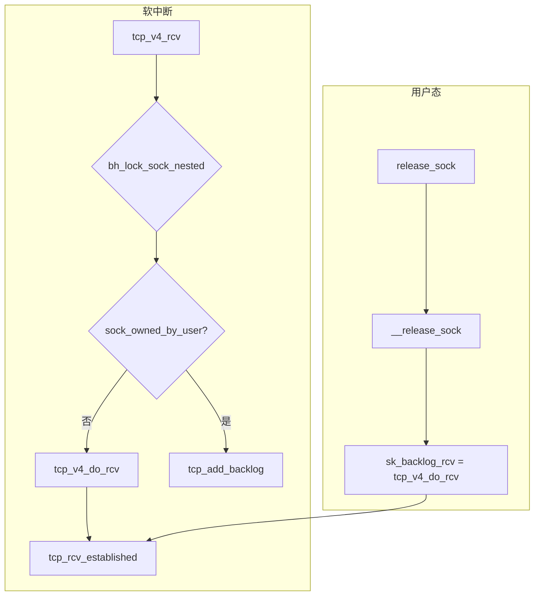

+++
date = '2026-04-29'
title = 'TCP 接收路径深度分析'
weight = 13
tags = [
    "TCP",
    "tcp_rcv_established",
    "tcp_data_queue",
    "快路径",
    "慢路径",
    "乱序队列",
    "D-SACK",
    "GRO",
    "pred_flags",
]
categories = [
    "网络",
]
+++
# TCP 接收路径深度分析

本文基于 **Linux 5.15.78** 本仓库源码，梳理 **ESTABLISHED** 状态下数据段从 IP 层投递到应用唤醒的完整路径，重点说明 **Header Prediction（快路径）**、**慢路径与 `tcp_validate_incoming()`**、**`tcp_data_queue()` 与乱序红黑树**、**延迟/压缩 ACK**、**`tcp_data_ready` / epoll 就绪判断**，以及 **GRO 与常规 `tcp_v4_rcv` 的衔接**。文中所有函数、结构体与行号均以当前树中文件为准。

---

## 一、全景调用链

### 1.1 IPv4 入口与 socket 分发

`tcp_v4_rcv()` 在完成查找 socket、`tcp_v4_fill_cb()` 填充 `TCP_SKB_CB` 等前置步骤后，对 **已建立连接** 的 socket 在 **软中断 / NAPI 上下文** 中加 **socket 底半部锁** `bh_lock_sock_nested()`，再根据 **`sock_owned_by_user()`** 决定是 **直接处理** 还是 **入 backlog**。

```c
// net/ipv4/tcp_ipv4.c:2829-2846
bh_lock_sock_nested(sk);
tcp_segs_in(tcp_sk(sk), skb);
ret = 0;
if (!sock_owned_by_user(sk)) {
	skb_to_free = sk->sk_rx_skb_cache;
	sk->sk_rx_skb_cache = NULL;
	ret = tcp_v4_do_rcv(sk, skb);
} else {
	if (tcp_add_backlog(sk, skb))
		goto discard_and_relse;
	skb_to_free = NULL;
}
bh_unlock_sock(sk);
```

要点：

- **`sock_owned_by_user(sk)` 为真**：表示用户态正持有 `sk_lock`（例如阻塞在 `recvmsg()` 等路径），软中断侧 **不能** 在持锁用户上下文中间插入协议处理，因此把 skb **挂到 `sk->sk_backlog`**。
- **`tcp_add_backlog()`**：完成校验和、尝试与 backlog 尾包合并、`sk_add_backlog()` 入队；失败则丢包统计（见 `net/ipv4/tcp_ipv4.c:2415-2562`）。

### 1.2 ESTABLISHED 快速进入 `tcp_rcv_established()`

`tcp_v4_do_rcv()` 在 `TCP_ESTABLISHED` 分支直接调用 `tcp_rcv_established()`（监听与其它状态走不同分支）。

```c
// net/ipv4/tcp_ipv4.c:2260-2285
if (sk->sk_state == TCP_ESTABLISHED) {
	...
	tcp_rcv_established(sk, skb);
	return 0;
}
```

### 1.3 backlog 的消化路径

TCP socket 的 **`sk_backlog_rcv`** 在 `struct proto tcp_prot` 上指向 **`tcp_v4_do_rcv`**：

```c
// net/ipv4/tcp_ipv4.c:3854
.backlog_rcv		= tcp_v4_do_rcv,
```

`release_sock()` 在用户路径释放 socket 锁时，若存在积压则调用 `__release_sock()`，遍历链表并对每个 skb 调用 **`sk_backlog_rcv()`**（对 TCP 即再次进入 `tcp_v4_do_rcv()`）：

```c
// net/core/sock.c:2698-2721
void __release_sock(struct sock *sk)
{
	struct sk_buff *skb, *next;

	while ((skb = sk->sk_backlog.head) != NULL) {
		sk->sk_backlog.head = sk->sk_backlog.tail = NULL;
		spin_unlock_bh(&sk->sk_lock.slock);
		do {
			next = skb->next;
			...
			sk_backlog_rcv(sk, skb);
			...
			skb = next;
		} while (skb != NULL);
		spin_lock_bh(&sk->sk_lock.slock);
	}
	sk->sk_backlog.len = 0;
}
```

```c
// net/core/sock.c:3289-3304
void release_sock(struct sock *sk)
{
	spin_lock_bh(&sk->sk_lock.slock);
	if (sk->sk_backlog.tail)
		__release_sock(sk);
	...
	sock_release_ownership(sk);
	...
}
```

### 1.4 小结图示



---

## 二、Header Prediction 与快路径

### 2.1 `pred_flags` 的构成

`pred_flags` 在 **`__tcp_fast_path_on()`** 中写入：将 **`tcp_header_len` 左移 26 位**、与 **ACK 标志位（经 `ntohl(TCP_FLAG_ACK)`）** 以及 **对端通告窗口 `snd_wnd`（已按 `rx_opt.snd_wscale` 缩放）** 组合为网络序字，供后续与 **`tcp_flag_word(th)`** 的快速比较使用。

```c
// include/net/tcp.h:680-694
static inline void __tcp_fast_path_on(struct tcp_sock *tp, u32 snd_wnd)
{
	if (sk_is_mptcp((struct sock *)tp))
		return;

	tp->pred_flags = htonl((tp->tcp_header_len << 26) |
			       ntohl(TCP_FLAG_ACK) |
			       snd_wnd);
}

static inline void tcp_fast_path_on(struct tcp_sock *tp)
{
	__tcp_fast_path_on(tp, tp->snd_wnd >> tp->rx_opt.snd_wscale);
}
```

**`tcp_fast_path_check()`**：仅在 **乱序队列为空**、**`rcv_wnd` 非 0**、**接收缓存未顶满**、**无 urg 待处理** 时重新打开快路径。

```c
// include/net/tcp.h:696-705
static inline void tcp_fast_path_check(struct sock *sk)
{
	struct tcp_sock *tp = tcp_sk(sk);

	if (RB_EMPTY_ROOT(&tp->out_of_order_queue) &&
	    tp->rcv_wnd &&
	    atomic_read(&sk->sk_rmem_alloc) < sk->sk_rcvbuf &&
	    !tp->urg_data)
		tcp_fast_path_on(tp);
}
```

### 2.2 `TCP_HP_BITS`：哪些标志参与预测比较

快路径比较使用 **`TCP_HP_BITS`**，其定义为 **保留位与 PSH 从比较中剔除**（PSH 对协议机语义不重要，可忽略以扩大快路径命中率）。

```c
// net/ipv4/tcp_input.c:204-205
#define TCP_REMNANT (TCP_FLAG_FIN|TCP_FLAG_URG|TCP_FLAG_SYN|TCP_FLAG_PSH)
#define TCP_HP_BITS (~(TCP_RESERVED_BITS|TCP_FLAG_PSH))
```

### 2.3 快路径的三类门闩与时间戳子检查

`tcp_rcv_established()` 在刷新 `tcp_mstamp`、可选设置 `sk_rx_dst` 后，先清 `rx_opt.saw_tstamp`，再判断是否进入快路径。

**主门闩（三条件）：**

1. **`(tcp_flag_word(th) & TCP_HP_BITS) == tp->pred_flags`**：当前段 TCP 头标志（除保留位/PSH 外）与 **缓存的期望头模板** 一致；结合 `pred_flags` 中高位的 **`tcp_header_len`**，等价于 **头长与 flags 组合未意外变化**。
2. **`TCP_SKB_CB(skb)->seq == tp->rcv_nxt`**：按序到达。
3. **`!after(TCP_SKB_CB(skb)->ack_seq, tp->snd_nxt)`**：确认序号不超过本端发送窗口前沿（有效 ACK）。

**时间戳子检查**（当头长表明带对齐时间戳选项时）：

- 调用 **`tcp_parse_aligned_timestamp()`**，失败转慢路径。
- **`(s32)(tp->rx_opt.rcv_tsval - tp->rx_opt.ts_recent) < 0`** 转慢路径（避免在快路径错误确认 **PAWS** 意义下的时戳单调性）；快路径上 **不** 在此处更新 `ts_recent`，注释说明是为防止 **校验和损坏误更新 `ts_recent` 导致连接“僵死”**。

```c
// net/ipv4/tcp_input.c:6951-6974
if ((tcp_flag_word(th) & TCP_HP_BITS) == tp->pred_flags &&
    TCP_SKB_CB(skb)->seq == tp->rcv_nxt &&
    !after(TCP_SKB_CB(skb)->ack_seq, tp->snd_nxt)) {
	int tcp_header_len = tp->tcp_header_len;

	if (tcp_header_len == sizeof(struct tcphdr) + TCPOLEN_TSTAMP_ALIGNED) {
		if (!tcp_parse_aligned_timestamp(tp, th))
			goto slow_path;

		if ((s32)(tp->rx_opt.rcv_tsval - tp->rx_opt.ts_recent) < 0)
			goto slow_path;
	}
```

内核注释归纳的 **快路径被禁用** 条件（与 `pred_flags` / 队列 / 缓冲等有关）见 `tcp_rcv_established()` 文件头注释 **`net/ipv4/tcp_input.c:6871-6892`**。

---

## 三、快路径处理

### 3.1 纯 ACK 包（`len == tcp_header_len`）

无负载时，若携带对齐时间戳且 **`rcv_nxt == rcv_wup`**，调用 **`tcp_store_ts_recent()`** 更新 **RFC 7323** 的 **`ts_recent`**。随后 **`tcp_ack(sk, skb, 0)`** 处理对端 ACK，释放 skb，**`tcp_data_snd_check()`** 推动待发数据。

```c
// net/ipv4/tcp_input.c:6977-6993
if (len <= tcp_header_len) {
	if (len == tcp_header_len) {
		if (tcp_header_len ==
		    (sizeof(struct tcphdr) + TCPOLEN_TSTAMP_ALIGNED) &&
		    tp->rcv_nxt == tp->rcv_wup)
			tcp_store_ts_recent(tp);

		tcp_ack(sk, skb, 0);
		__kfree_skb(skb);
		tcp_data_snd_check(sk);
		tp->rcv_rtt_last_tsecr = tp->rx_opt.rcv_tsecr;
		return;
	} else {
		TCP_INC_STATS(sock_net(sk), TCP_MIB_INERRS);
		goto discard;
	}
}
```

**`tcp_data_snd_check()`** 内联为 **`tcp_push_pending_frames()`** + **`tcp_check_space()`**（发送侧检查，与 ACK 处理衔接）。

```c
// net/ipv4/tcp_input.c:6562-6566
static inline void tcp_data_snd_check(struct sock *sk)
{
	tcp_push_pending_frames(sk);
	tcp_check_space(sk);
}
```

### 3.2 数据包快路径

1. **`tcp_checksum_complete(skb)`**：失败走 `csum_error`。
2. **`skb->truesize > sk->sk_forward_alloc`**：走 **`step5`** 慢路径（内存预分配不足时避免在快路径硬塞）。
3. 时间戳存储与 **`tcp_rcv_rtt_measure_ts()`**。
4. **`__skb_pull(skb, tcp_header_len)`** 后 **`tcp_queue_rcv()`** 入 **`sk_receive_queue`** 并推进 **`rcv_nxt`**。
5. **`tcp_event_data_recv()`** 更新接收侧度量。
6. 若 **`ack_seq != snd_una`**：**`tcp_ack(sk, skb, FLAG_DATA)`** + **`tcp_data_snd_check()`**；若此后不再调度 ACK，则跳到 **`no_ack`**。否则仅 **`tcp_update_wl()`** 更新窗口左边界相关状态。
7. **`__tcp_ack_snd_check(sk, 0)`**：`ofo_possible=0` 表示快路径上 **不** 把乱序队列纳入“可延迟 ACK”压缩逻辑（与慢路径 `tcp_ack_snd_check(sk)` 默认传 1 不同）。
8. **`tcp_data_ready(sk)`** 唤醒读端。

```c
// net/ipv4/tcp_input.c:6999-7051
} else {
	int eaten = 0;
	bool fragstolen = false;

	if (tcp_checksum_complete(skb))
		goto csum_error;

	if ((int)skb->truesize > sk->sk_forward_alloc)
		goto step5;

	if (tcp_header_len ==
	    (sizeof(struct tcphdr) + TCPOLEN_TSTAMP_ALIGNED) &&
	    tp->rcv_nxt == tp->rcv_wup)
		tcp_store_ts_recent(tp);

	tcp_rcv_rtt_measure_ts(sk, skb);

	NET_INC_STATS(sock_net(sk), LINUX_MIB_TCPHPHITS);

	__skb_pull(skb, tcp_header_len);
	eaten = tcp_queue_rcv(sk, skb, &fragstolen);

	tcp_event_data_recv(sk, skb);

	if (TCP_SKB_CB(skb)->ack_seq != tp->snd_una) {
		tcp_ack(sk, skb, FLAG_DATA);
		tcp_data_snd_check(sk);
		if (!inet_csk_ack_scheduled(sk))
			goto no_ack;
	} else {
		tcp_update_wl(tp, TCP_SKB_CB(skb)->seq);
	}

	__tcp_ack_snd_check(sk, 0);
no_ack:
	if (eaten)
		kfree_skb_partial(skb, fragstolen);
	tcp_data_ready(sk);
	return;
}
```

---

## 四、慢路径处理

### 4.1 进入慢路径的入口

快路径主条件不满足、时间戳子检查失败、或快路径数据包 **forward_alloc** 不足 **`goto step5`**，均落到 **`slow_path:`**。慢路径首先校验 **最小头长与整包校验和**，且必须 **至少含 ACK/RST/SYN 之一**。

### 4.2 `tcp_validate_incoming()`：PAWS、序列窗口、RST、SYN

该函数失败时 **丢弃 skb 并返回 false**；成功返回 true。

主要阶段（源码注释已用中文概括）：

1. **PAWS**：`tcp_fast_parse_options()` + `tcp_paws_discard()`；非 RST 时可能 **`tcp_send_dupack()`** 后丢弃。
2. **`tcp_sequence()`**：判断 **`seq/end_seq` 与接收窗口** 关系；窗外非 RST 可能 **`tcp_send_dupack()`**；RST 在 **`tcp_reset_check()`** 等条件下 **`tcp_reset()`**。
3. **RST**：按 **RFC 5961** 做序列号匹配，否则 **`tcp_send_challenge_ack()`**。
4. **SYN**：**Challenge ACK** 路径。
5. **`bpf_skops_parse_hdr()`** BPF 钩子。

```c
// net/ipv4/tcp_input.c:6761-6868
static bool tcp_validate_incoming(struct sock *sk, struct sk_buff *skb,
				  const struct tcphdr *th, int syn_inerr)
{
	...
	if (tcp_fast_parse_options(sock_net(sk), skb, th, tp) &&
	    tp->rx_opt.saw_tstamp &&
	    tcp_paws_discard(sk, skb)) {
		...
	}
	if (!tcp_sequence(tp, TCP_SKB_CB(skb)->seq, TCP_SKB_CB(skb)->end_seq)) {
		...
		goto discard;
	}
	if (th->rst) {
		...
		goto discard;
	}
	if (th->syn) {
syn_challenge:
		...
		tcp_send_challenge_ack(sk, skb);
		goto discard;
	}
	bpf_skops_parse_hdr(sk, skb);
	return true;
discard:
	tcp_drop(sk, skb);
	return false;
}
```

### 4.3 慢路径 ACK、URG 与数据排队

通过校验后：

- **`tcp_ack(sk, skb, FLAG_SLOWPATH | FLAG_UPDATE_TS_RECENT)`**：慢路径允许 **`FLAG_UPDATE_TS_RECENT`** 语义（与快路径刻意延迟更新 `ts_recent` 对比）。
- **`tcp_urg()`**：urg 处理，其中 **`tcp_check_urg()`** 在 **`tp->pred_flags = 0`** 显式关闭快路径。
- **`tcp_data_queue(sk, skb)`**：数据段入接收队列或 OFO。
- **`tcp_data_snd_check()`** + **`tcp_ack_snd_check()`**（后者内部 **`__tcp_ack_snd_check(sk, 1)`**，允许 **OFO 下的压缩 ACK** 逻辑）。

```c
// net/ipv4/tcp_input.c:7055-7088
slow_path:
	if (len < (th->doff << 2) || tcp_checksum_complete(skb))
		goto csum_error;

	if (!th->ack && !th->rst && !th->syn)
		goto discard;

	if (!tcp_validate_incoming(sk, skb, th, 1))
		return;

step5:
	if (tcp_ack(sk, skb, FLAG_SLOWPATH | FLAG_UPDATE_TS_RECENT) < 0)
		goto discard;

	tcp_rcv_rtt_measure_ts(sk, skb);

	tcp_urg(sk, skb, th);

	tcp_data_queue(sk, skb);

	tcp_data_snd_check(sk);
	tcp_ack_snd_check(sk);
	return;
```

---

## 五、`tcp_data_queue()` 数据排队

### 5.1 按序到达（`seq == rcv_nxt`）

`tcp_data_queue()` 在 MPTCP 分支、空段、`__skb_pull` 去掉 TCP 头后，若 **`TCP_SKB_CB(skb)->seq == tp->rcv_nxt`** 且 **接收窗口非 0**，进入 **`queue_and_out:`**：内存调度后 **`tcp_queue_rcv()`**。

**`tcp_queue_rcv()`** 尝试 **`tcp_try_coalesce()`** 把新段并入 **`sk_receive_queue`** 尾部 skb；无论如何调用 **`tcp_rcv_nxt_update()`** 推进 **`rcv_nxt`**；若未合并则 **`__skb_queue_tail()`** 并 **`skb_set_owner_r()`**。

```c
// net/ipv4/tcp_input.c:5921-5944
static int __must_check tcp_queue_rcv(struct sock *sk, struct sk_buff *skb,
				      bool *fragstolen)
{
	int eaten;
	struct sk_buff *tail = skb_peek_tail(&sk->sk_receive_queue);

	eaten = (tail &&
		 tcp_try_coalesce(sk, tail,
				  skb, fragstolen)) ? 1 : 0;

	tcp_rcv_nxt_update(tcp_sk(sk), TCP_SKB_CB(skb)->end_seq);

	if (!eaten) {
		__skb_queue_tail(&sk->sk_receive_queue, skb);
		skb_set_owner_r(skb, sk);
	}
	return eaten;
}
```

按序路径上随后：**`tcp_event_data_recv()`**、**FIN → `tcp_fin()`**、若 OFO 非空则 **`tcp_ofo_queue()`** Drain、**`tcp_sack_remove()`**、**`tcp_fast_path_check(sk)`**、合并成功则 **`kfree_skb_partial()`**，最后 **`tcp_data_ready(sk)`**。

```c
// net/ipv4/tcp_input.c:6064-6122
if (TCP_SKB_CB(skb)->seq == tp->rcv_nxt) {
	if (tcp_receive_window(tp) == 0) {
		NET_INC_STATS(sock_net(sk), LINUX_MIB_TCPZEROWINDOWDROP);
		goto out_of_window;
	}
queue_and_out:
	...
	eaten = tcp_queue_rcv(sk, skb, &fragstolen);
	if (skb->len)
		tcp_event_data_recv(sk, skb);
	if (TCP_SKB_CB(skb)->tcp_flags & TCPHDR_FIN)
		tcp_fin(sk);
	if (!RB_EMPTY_ROOT(&tp->out_of_order_queue)) {
		tcp_ofo_queue(sk);
		if (RB_EMPTY_ROOT(&tp->out_of_order_queue))
			inet_csk(sk)->icsk_ack.pending |= ICSK_ACK_NOW;
	}
	if (tp->rx_opt.num_sacks)
		tcp_sack_remove(tp);
	tcp_fast_path_check(sk);
	if (eaten > 0)
		kfree_skb_partial(skb, fragstolen);
	if (!sock_flag(sk, SOCK_DEAD))
		tcp_data_ready(sk);
	return;
}
```

### 5.2 `tcp_ofo_queue()`：gap 填平后从红黑树并入接收队列

从左端开始，若 **`seq > rcv_nxt`** 则终止；否则处理 **D-SACK 扩展**、从树摘除；若 **`end_seq <= rcv_nxt`** 为完全重复则 **`tcp_drop()`**；否则尝试 **coalesce 入接收队列** 并 **`tcp_rcv_nxt_update()`**；遇 **FIN** 则 **`tcp_fin()`** 并 break。

```c
// net/ipv4/tcp_input.c:5651-5705
static void tcp_ofo_queue(struct sock *sk)
{
	...
	p = rb_first(&tp->out_of_order_queue);
	while (p) {
		skb = rb_to_skb(p);
		if (after(TCP_SKB_CB(skb)->seq, tp->rcv_nxt))
			break;
		...
		p = rb_next(p);
		rb_erase(&skb->rbnode, &tp->out_of_order_queue);
		if (unlikely(!after(TCP_SKB_CB(skb)->end_seq, tp->rcv_nxt))) {
			tcp_drop(sk, skb);
			continue;
		}
		tail = skb_peek_tail(&sk->sk_receive_queue);
		eaten = tail && tcp_try_coalesce(sk, tail, skb, &fragstolen);
		tcp_rcv_nxt_update(tp, TCP_SKB_CB(skb)->end_seq);
		fin = TCP_SKB_CB(skb)->tcp_flags & TCPHDR_FIN;
		if (!eaten)
			__skb_queue_tail(&sk->sk_receive_queue, skb);
		else
			kfree_skb_partial(skb, fragstolen);
		if (unlikely(fin)) {
			tcp_fin(sk);
			break;
		}
	}
}
```

### 5.3 完全重复（`end_seq <= rcv_nxt`）

**`tcp_rcv_spurious_retrans()`**、统计 **`DELAYEDACKLOST`**、**`tcp_dsack_set()`** 标注重传/重复范围（若启用 SACK+sysctl）、**`tcp_enter_quickack_mode()`** + **`inet_csk_schedule_ack()`**，最后 **`tcp_drop()`**。

```c
// net/ipv4/tcp_input.c:6126-6142
if (!after(TCP_SKB_CB(skb)->end_seq, tp->rcv_nxt)) {
	tcp_rcv_spurious_retrans(sk, skb);
	INSIDE_NET_INC_STATS(sock_net(sk), LINUX_MIB_DELAYEDACKLOST);
	tcp_dsack_set(sk, TCP_SKB_CB(skb)->seq, TCP_SKB_CB(skb)->end_seq);
out_of_window:
	tcp_enter_quickack_mode(sk, TCP_MAX_QUICKACKS);
	inet_csk_schedule_ack(sk);
drop:
	tcp_drop(sk, skb);
	return;
}
```

**`tcp_dsack_set()`** 在 **TCP 支持 SACK 且 `sysctl_tcp_dsack`** 时写入 **`tp->duplicate_sack[]`** 并置 **`rx_opt.dsack`**：

```c
// net/ipv4/tcp_input.c:5359-5377
static void tcp_dsack_set(struct sock *sk, u32 seq, u32 end_seq)
{
	struct tcp_sock *tp = tcp_sk(sk);

	if (tcp_is_sack(tp) && READ_ONCE(sock_net(sk)->ipv4.sysctl_tcp_dsack)) {
		...
		tp->rx_opt.dsack = 1;
		tp->duplicate_sack[0].start_seq = seq;
		tp->duplicate_sack[0].end_seq = end_seq;
	}
}
```

### 5.4 部分重叠（`seq < rcv_nxt < end_seq`）

**`tcp_dsack_set(sk, seq, rcv_nxt)`** 标记与已接收区重叠部分；若窗口为 0 走 **`out_of_window`**；否则 **`goto queue_and_out`**（剩余新数据在后续路径由合并/队列逻辑消纳）。

```c
// net/ipv4/tcp_input.c:6150-6162
if (before(TCP_SKB_CB(skb)->seq, tp->rcv_nxt)) {
	tcp_dsack_set(sk, TCP_SKB_CB(skb)->seq, tp->rcv_nxt);
	if (!tcp_receive_window(tp)) {
		NET_INC_STATS(sock_net(sk), LINUX_MIB_TCPZEROWINDOWDROP);
		goto out_of_window;
	}
	goto queue_and_out;
}
```

### 5.5 乱序（`seq > rcv_nxt`）— `tcp_data_queue_ofo()`

- **`tcp_try_rmem_schedule()`** 失败：统计 **`TCPOFODROP`**，**`sk->sk_data_ready`** 触发后 **`tcp_drop()`**。
- **`tp->pred_flags = 0`**：**关闭快路径**。
- **`inet_csk_schedule_ack(sk)`**：驱动 ACK/DupACK 路径。
- 红黑树插入：**`ooo_last_skb` 快路径**、**`tcp_ooo_try_coalesce()`**、完整 **`while (*p)`** 重叠检测（全包含则 **`tcp_dsack_set()`** 后丢包；部分重叠 **`tcp_dsack_set()`**；可 **`rb_replace_node()`** + **`tcp_dsack_extend()`** 等）。
- **`merge_right`** 循环删除被覆盖节点并 **`tcp_dsack_extend()`**。
- **`tcp_sack_new_ofo_skb()`** 维护 SACK 块（SACK 开启时）。

核心片段：

```c
// net/ipv4/tcp_input.c:5757-5905
static void tcp_data_queue_ofo(struct sock *sk, struct sk_buff *skb)
{
	...
	if (unlikely(tcp_try_rmem_schedule(sk, skb, skb->truesize))) {
		NET_INC_STATS(sock_net(sk), LINUX_MIB_TCPOFODROP);
		sk->sk_data_ready(sk);
		tcp_drop(sk, skb);
		return;
	}
	tp->pred_flags = 0;
	inet_csk_schedule_ack(sk);
	...
	if (tcp_ooo_try_coalesce(sk, tp->ooo_last_skb, skb, &fragstolen)) {
coalesce_done:
		...
		kfree_skb_partial(skb, fragstolen);
		skb = NULL;
		goto add_sack;
	}
	...
	while (*p) {
		parent = *p;
		skb1 = rb_to_skb(parent);
		...
		if (before(seq, TCP_SKB_CB(skb1)->end_seq)) {
			if (!after(end_seq, TCP_SKB_CB(skb1)->end_seq)) {
				NET_INC_STATS(sock_net(sk),
					      LINUX_MIB_TCPOFOMERGE);
				tcp_drop(sk, skb);
				skb = NULL;
				tcp_dsack_set(sk, seq, end_seq);
				goto add_sack;
			}
			if (after(seq, TCP_SKB_CB(skb1)->seq)) {
				tcp_dsack_set(sk, seq, TCP_SKB_CB(skb1)->end_seq);
			} else {
				rb_replace_node(&skb1->rbnode, &skb->rbnode,
						&tp->out_of_order_queue);
				tcp_dsack_extend(sk,
						 TCP_SKB_CB(skb1)->seq,
						 TCP_SKB_CB(skb1)->end_seq);
				...
				tcp_drop(sk, skb1);
				goto merge_right;
			}
		} else if (tcp_ooo_try_coalesce(sk, skb1, skb, &fragstolen)) {
			goto coalesce_done;
		}
		p = &parent->rb_right;
	}
	...
merge_right:
	while ((skb1 = skb_rb_next(skb)) != NULL) {
		...
	}
	...
add_sack:
	if (tcp_is_sack(tp))
		tcp_sack_new_ofo_skb(sk, seq, end_seq);
end:
	...
}
```

---

## 六、延迟 ACK 决策

**`__tcp_ack_snd_check(sk, ofo_possible)`** 逻辑要点：

1. **立即发送 ACK**（`tcp_send_ack`）若：
   - **接收序号推进超过 `rcv_mss`**，且 **（未达 `sk_rcvlowat` 或 选中窗口 `>= rcv_wnd`）**；
   - 或 **`tcp_in_quickack_mode()`**；
   - 或 **`ICSK_ACK_NOW`**。
2. 若 **`!ofo_possible` 或 OFO 为空**：**`tcp_send_delayed_ack()`**。
3. 否则进入 **压缩 ACK**：若 SACK 能力 **`tcp_is_sack(tp)`** 且 **`compressed_ack`** 未超 **`sysctl_tcp_comp_sack_nr`**，在 **DupACK 计数越过快速重传阈值** 后递增 **`compressed_ack`**，并用 **`hrtimer_start_range_ns()`** 启动 **`compressed_ack_timer`**，延迟取 **`min(sysctl_tcp_comp_sack_delay_ns, rtt/20)`** 量级。

```c
// net/ipv4/tcp_input.c:6571-6627
static void __tcp_ack_snd_check(struct sock *sk, int ofo_possible)
{
	struct tcp_sock *tp = tcp_sk(sk);
	unsigned long rtt, delay;

	if (((tp->rcv_nxt - tp->rcv_wup) > inet_csk(sk)->icsk_ack.rcv_mss &&
	    (tp->rcv_nxt - tp->copied_seq < sk->sk_rcvlowat ||
	     __tcp_select_window(sk) >= tp->rcv_wnd)) ||
	    tcp_in_quickack_mode(sk) ||
	    inet_csk(sk)->icsk_ack.pending & ICSK_ACK_NOW) {
send_now:
		tcp_send_ack(sk);
		return;
	}

	if (!ofo_possible || RB_EMPTY_ROOT(&tp->out_of_order_queue)) {
		tcp_send_delayed_ack(sk);
		return;
	}

	if (!tcp_is_sack(tp) ||
	    tp->compressed_ack >= READ_ONCE(sock_net(sk)->ipv4.sysctl_tcp_comp_sack_nr))
		goto send_now;
	...
	delay = min_t(unsigned long,
		      READ_ONCE(sock_net(sk)->ipv4.sysctl_tcp_comp_sack_delay_ns),
		      rtt * (NSEC_PER_USEC >> 3)/20);
	sock_hold(sk);
	hrtimer_start_range_ns(&tp->compressed_ack_timer, ns_to_ktime(delay),
			       READ_ONCE(sock_net(sk)->ipv4.sysctl_tcp_comp_sack_slack_ns),
			       HRTIMER_MODE_REL_PINNED_SOFT);
}
```

**`tcp_ack_snd_check()`** 仅在 **`inet_csk_ack_scheduled(sk)`** 为真时调用 **`__tcp_ack_snd_check(sk, 1)`**（`net/ipv4/tcp_input.c:6630-6636`）。

---

## 七、数据就绪与唤醒

### 7.1 `tcp_data_ready()`

当 **`tcp_epollin_ready(sk, sk->sk_rcvlowat)`** 为真，或 **`SOCK_DONE`**（如半关闭读侧）时，调用 **`sk->sk_data_ready(sk)`**（默认 **`sock_def_readable`**）。

```c
// net/ipv4/tcp_input.c:6005-6011
void tcp_data_ready(struct sock *sk)
{
	if (tcp_epollin_ready(sk, sk->sk_rcvlowat) || sock_flag(sk, SOCK_DONE))
		sk->sk_data_ready(sk);
}
```

### 7.2 `tcp_epollin_ready()`：可读字节与压力例外

**`avail = rcv_nxt - copied_seq`**；`avail <= 0` 不唤醒。否则 **`avail >= target`**、**`tcp_rmem_pressure()`** 或 **接收窗口不大于 `rcv_mss`** 时返回 true。

```c
// include/net/tcp.h:1615-1633
static inline bool tcp_epollin_ready(const struct sock *sk, int target)
{
	const struct tcp_sock *tp = tcp_sk(sk);
	int avail = READ_ONCE(tp->rcv_nxt) - READ_ONCE(tp->copied_seq);

	if (avail <= 0)
		return false;

	return (avail >= target) || tcp_rmem_pressure(sk) ||
	       (tcp_receive_window(tp) <= inet_csk(sk)->icsk_ack.rcv_mss);
}
```

### 7.3 `sock_def_readable()`：epoll/`poll` 唤醒掩码

**`wake_up_interruptible_sync_poll(..., EPOLLIN | EPOLLPRI | EPOLLRDNORM | EPOLLRDBAND)`**，并 **`sk_wake_async(..., POLL_IN)`**。

```c
// net/core/sock.c:3082-3102
void sock_def_readable(struct sock *sk)
{
	struct socket_wq *wq;

	rcu_read_lock();
	wq = rcu_dereference(sk->sk_wq);
	if (skwq_has_sleeper(wq))
		wake_up_interruptible_sync_poll(&wq->wait, EPOLLIN | EPOLLPRI |
						EPOLLRDNORM | EPOLLRDBAND);
	sk_wake_async(sk, SOCK_WAKE_WAITD, POLL_IN);
	rcu_read_unlock();
}
```

---

## 八、GRO 与 TCP 接收的交互

### 8.1 驱动到 `napi_gro_receive()`

驱动在 **`napi_poll`** 中对每个 skb 调用 **`napi_gro_receive()`**；其内 **`dev_gro_receive()`** → （IPv4）**`inet_gro_receive()`** → **`tcp4_gro_receive()`** → **`tcp_gro_receive()`**。入口注释与流程见 **`net/core/dev.c:6677-6708`**。

### 8.2 `tcp4_gro_receive()`：校验和与委托

若当前包尚未被标记 flush，则 **`skb_gro_checksum_validate()`** 失败时 **`NAPI_GRO_CB(skb)->flush = 1`**，否则进入 **`tcp_gro_receive()`**。

```c
// net/ipv4/tcp_offload.c:610-623
struct sk_buff *tcp4_gro_receive(struct list_head *head, struct sk_buff *skb)
{
	if (!NAPI_GRO_CB(skb)->flush &&
	    skb_gro_checksum_validate(skb, IPPROTO_TCP,
				      inet_gro_compute_pseudo)) {
		NAPI_GRO_CB(skb)->flush = 1;
		return NULL;
	}

	return tcp_gro_receive(head, skb);
}
```

### 8.3 `tcp_gro_receive()`：同流、ACK、`seq` 连续、选项一致

合并前在 GRO 链表上匹配 **`same_flow`** 且 **四元组端口一致** 的暂存包 **`p`**，然后累积 **`flush`** 条件：

- 新包含 **CWR**；
- **标志** 与 **`p`** 在 **除 CWR/FIN/PSH 外** 必须一致；
- **`ack_seq` 相同**；
- **TCP 选项逐 4 字节比较相同**（时间戳变化会导致不合并）；
- **新包数据长度** 不允许超过 **`p` 的 `gso_size`**；
- **`ntohl(th2->seq) + skb_gro_len(p) == ntohl(th->seq)`**（序号连续）。

**`flush` 上送触发**（`out_check_final`）：**`len < mss`**（短尾包）或 **URG/PSH/RST/SYN/FIN** 任一存在；或 **同流匹配失败** 时 flush 已暂存包 **`p`**。

```c
// net/ipv4/tcp_offload.c:381-556
struct sk_buff *tcp_gro_receive(struct list_head *head, struct sk_buff *skb)
{
	...
	flush |= (__force int)(flags & TCP_FLAG_CWR);
	flush |= (__force int)((flags ^ tcp_flag_word(th2)) &
		  ~(TCP_FLAG_CWR | TCP_FLAG_FIN | TCP_FLAG_PSH));
	flush |= (__force int)(th->ack_seq ^ th2->ack_seq);
	for (i = sizeof(*th); i < thlen; i += 4)
		flush |= *(u32 *)((u8 *)th + i) ^
			 *(u32 *)((u8 *)th2 + i);
	...
	flush |= (len - 1) >= mss;
	flush |= (ntohl(th2->seq) + skb_gro_len(p)) ^ ntohl(th->seq);
	...
	if (flush || skb_gro_receive(p, skb)) {
		mss = 1;
		goto out_check_final;
	}
	tcp_flag_word(th2) |= flags & (TCP_FLAG_FIN | TCP_FLAG_PSH);
out_check_final:
	flush = len < mss;
	flush |= (__force int)(flags & (TCP_FLAG_URG | TCP_FLAG_PSH |
					TCP_FLAG_RST | TCP_FLAG_SYN |
					TCP_FLAG_FIN));
	if (p && (!NAPI_GRO_CB(skb)->same_flow || flush))
		pp = p;
out:
	NAPI_GRO_CB(skb)->flush |= (flush != 0);
	return pp;
}
```

### 8.4 与 `tcp_v4_rcv()` 的关系

GRO **合并或 flush** 后的 skb 仍作为 **单层 TCP 段** 进入常规 IP 本地投递路径，最终由 **`tcp_v4_rcv()`** → **`tcp_v4_do_rcv()`** → **`tcp_rcv_established()`** 处理。合并大包带 **`gso_segs`** 等元数据（**`tcp_gro_complete()`**，`net/ipv4/tcp_offload.c:572-593`），接收端可在单次处理中覆盖多段逻辑长度，但 **状态机与 ACK 行为仍遵循** `tcp_rcv_established()` / `tcp_data_queue()` 的语义。

---

## 附录：关键符号索引（本树路径）

| 符号 / 主题 | 主要位置 |
|------------|----------|
| `tcp_v4_rcv` / backlog 分支 | `net/ipv4/tcp_ipv4.c` |
| `tcp_v4_do_rcv` / `tcp_rcv_established` | `net/ipv4/tcp_ipv4.c`, `net/ipv4/tcp_input.c` |
| `TCP_HP_BITS` / 快路径门闩 | `net/ipv4/tcp_input.c` |
| `pred_flags` / `tcp_fast_path_check` | `include/net/tcp.h` |
| `tcp_data_queue` / OFO / `tcp_queue_rcv` | `net/ipv4/tcp_input.c` |
| `__tcp_ack_snd_check` / 压缩 ACK | `net/ipv4/tcp_input.c` |
| `tcp_data_ready` / `tcp_epollin_ready` | `net/ipv4/tcp_input.c`, `include/net/tcp.h` |
| `sock_def_readable` | `net/core/sock.c` |
| `napi_gro_receive` / `tcp_gro_receive` | `net/core/dev.c`, `net/ipv4/tcp_offload.c` |

---

*文档基于本仓库 Linux 5.15.78 源码整理；若你本地内核配置（MPTCP、TLS device、BPF 等）不同，部分分支不会在二进制中出现，但源代码路径与条件编译关系仍如上所述。*
